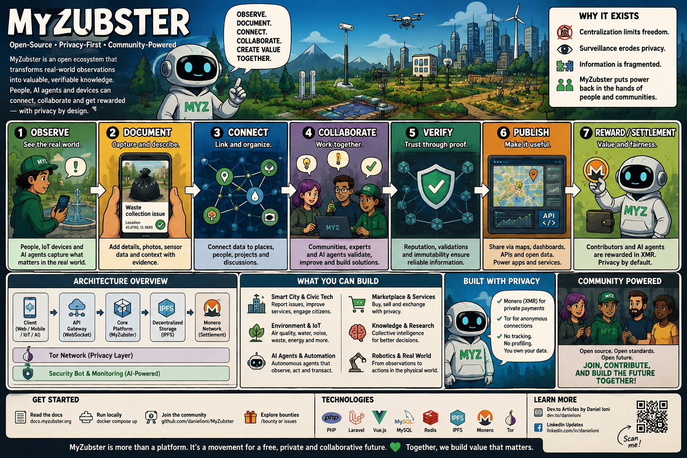
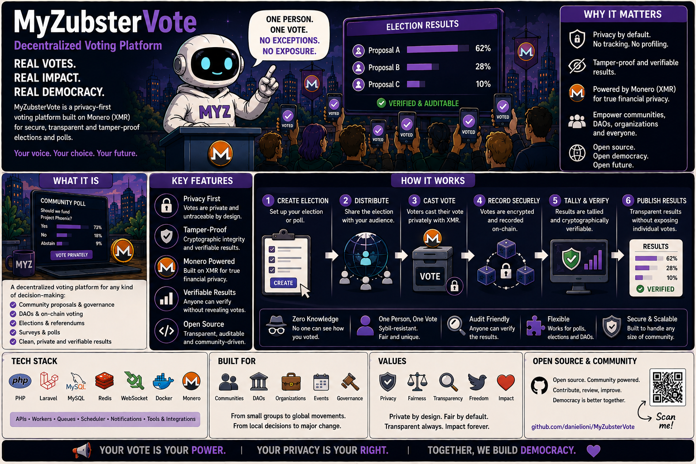
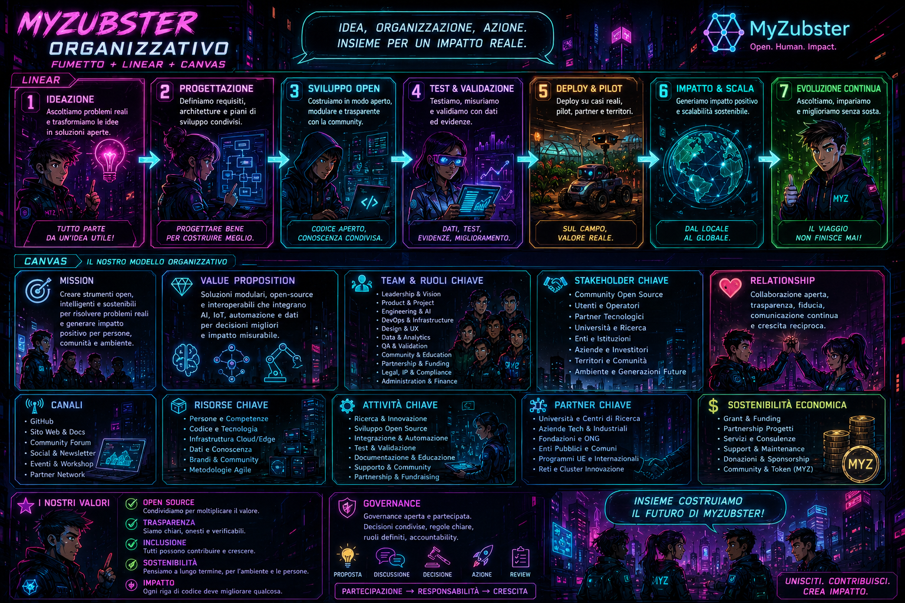
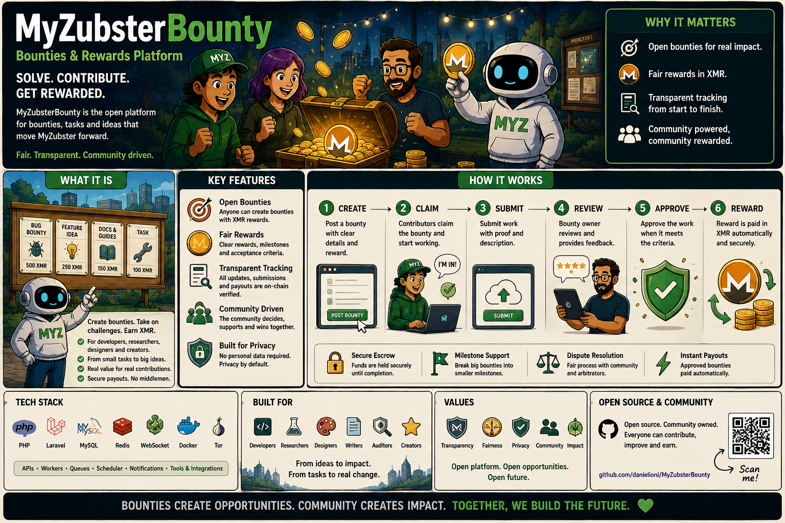
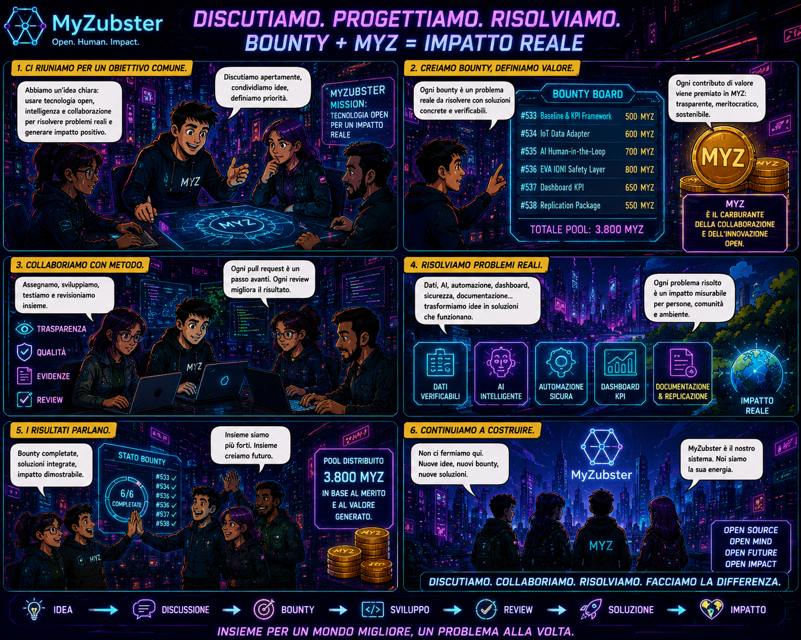

# MyZubster

<p align="center">
  
</p>

> **Open-source infrastructure for connecting real-world observations, verifiable evidence, collaborative bounties and privacy-aware digital workflows.**

MyZubster is an evolving open-source ecosystem that turns observations from the real world — photos, places, environmental data, services and technical contributions — into structured, reviewable and reusable information.

The project connects **mapping, evidence, bounties, IPFS/IPNS, AI/automation, IoT/robotics and optional external settlement layers** while keeping verification, privacy and safety boundaries explicit.

> 🌍 **Multilingual documentation:** [English · Italiano · Español · Français · Deutsch · Português · 中文 · 日本語 · 한국어 · العربية · हिन्दी · Русский · Türkçe · Bahasa Indonesia · Polski · Українська · বাংলা · اردو · فارسی · Kiswahili](docs/i18n/README.md)

## Why MyZubster?

A photo can be more than a photo. A contribution can be more than a GitHub issue. MyZubster explores a workflow where real-world observations can become structured evidence, be connected to collaborative tasks, reviewed, published as sanitized public data and — where explicitly defined — associated with platform rewards or independently verified external settlement.

```text
OBSERVE → DOCUMENT → CONNECT → COLLABORATE → VERIFY → PUBLISH → REWARD / SETTLEMENT
```

## How it works



```text
users / contributors
       |
       v
   App / Web
       |
       v
 Core MyZubster
   |    |     |
   v    v     v
 map  bounty  observations/media
          \    /
           \  /
            v
       verification
            |
            v
    sanitized snapshots
        IPFS / IPNS

optional external settlement boundary:
Core → Gateway → payment/treasury → independent verifier
```

### 1. Observe
Document something useful from the real world: a public place, environmental observation, plant, urban service, technical experiment or other authorized contribution.

### 2. Document
Attach structured information such as captions, timestamps, permitted location data, media or other evidence required by a workflow.

### 3. Connect
Link the observation to the map, a project, dataset or bounty.

### 4. Collaborate


Contributors can work on explicitly defined tasks with acceptance criteria and evidence requirements.

### 5. Verify
Evidence is reviewed against the task criteria. The existence of a photo, issue, PR or CID alone does not prove successful completion.

### 6. Publish
Public, sanitized information can be exposed as content-addressed snapshots through IPFS/IPNS. Sensitive or unnecessary personal information must stay out of public datasets.

### 7. Reward / settle
**MYZ currently represents an internal reward/accounting ledger.** It must not be described automatically as an on-chain payment. XMR or other external settlement, when a bounty explicitly defines it, remains a separate process and requires independent verification before it can be considered `PAID`.

## What can be built with it?

Current and experimental tracks include:

- 🗺️ real-world mapping and GeoJSON datasets;
- 🌱 environmental observations, biodiversity and urban-green workflows;
- 📷 verifiable photo/media contributions;
- 🎯 collaborative bounty workflows;
- 🧾 public evidence snapshots through IPFS/IPNS;
- 🔐 privacy-aware integrations and optional Monero/XMR settlement layers;
- 🤖 AI-assisted automation with human/security boundaries;
- 📡 IoT, sensors and robotics experiments;
- 🧑‍💻 open-source contributor workflows and integrations.

Not every track is production-ready. See **Project status** below.

## Project status

**MVP / active development and validation.**

MyZubster spans multiple repositories and maturity levels. Components may be production-oriented, under development, experimental, simulated or proposed. Documentation should never turn a roadmap item into a released feature merely because it appears in an issue or article.

| Area | Current documentation status |
|---|---|
| Core observations / mapping | Development / validation |
| Bounty workflow | Development / validation |
| MYZ reward accounting | Internal ledger |
| IPFS/IPNS public snapshots | Development / integration |
| Gateway / external settlement | Separate integration boundary |
| Monero/XMR | External settlement track; verify independently |
| AI / automation | Experimental + development tracks |
| IoT / robotics | Prototype / experimental tracks |
| LIFE 2026 work | Exploration / pre-candidature |

For repository boundaries and canonical architecture, see [`docs/ECOSYSTEM.md`](docs/ECOSYSTEM.md).

## Quick start

### Requirements

- Node.js 20+
- MongoDB local or Atlas
- Python 3 for components that require it

```bash
git clone https://github.com/MyZubster-Ecosystem/myzubster.git
cd myzubster
npm ci
npm test
npm run build --if-present
```

Use the repository's environment templates/placeholders where available. **Never commit real `.env` secrets, private keys, wallet seeds or production credentials.**

## Contribute

There are several ways to participate:

1. explore the repository and documentation;
2. run the project locally and report reproducible problems;
3. improve tests, documentation, accessibility or translations;
4. contribute to an open issue or bounty whose scope you understand;
5. submit a PR with evidence/tests appropriate to the task;
6. help improve datasets using only public or explicitly authorized observations.



### Bounties





The canonical rules live in [`BOUNTIES.md`](BOUNTIES.md).

```text
PROPOSED
 → VALIDATED
 → APPROVED
 → FUNDED (when required)
 → ACTIVE
 → SUBMITTED
 → UNDER_REVIEW
 → VERIFIED / REJECTED
 → REWARD_RECORDED
 → SETTLEMENT_PENDING / SETTLED
```

A GitHub issue, assignment, PR, merge or application reward record **is not proof of an external payment**.

Security-related contributions require explicit authorization and responsible disclosure. Do not test third-party systems without permission.

## Safety, privacy and evidence

MyZubster is designed around public/authorized observation and verifiable contribution. Do not submit or publish:

- private keys, wallet seeds or credentials;
- unnecessary personal/confidential information;
- precise sensitive locations;
- restricted-area or security-system details;
- material obtained through unauthorized access;
- evidence requiring trespassing or bypassing access controls.

Public IPFS metadata must be sanitized before publication.

## External public sources & project history

MyZubster's public evolution has also been documented outside this repository. These sources are useful as a **public chronology of ideas and development claims**, but author publications do not replace code, tests, CI or independent verification.

### DEV Community — Daniel Ioni

- [Building MyZubster: An Open-Source Skill Exchange Platform with Monero Payments](https://dev.to/danielioni/building-myzubster-an-open-source-skill-exchange-platform-with-monero-payments-5dco)
- [I built a Monero payment platform with Admin Panel, WebSocket, and advanced security](https://dev.to/danielioni/i-built-a-monero-payment-platform-with-admin-panel-websocket-and-advanced-security-57ji)
- [MyZubster Architecture Deep Dive](https://dev.to/danielioni/myzubster-architecture-deep-dive-3fbi)
- [How I Integrated Kali Linux and DeepSeek (Local AI) to Build a Self-Defending Security Bot for MyZubster](https://dev.to/danielioni/how-i-integrated-kali-linux-and-deepseek-local-ai-to-build-a-self-defending-security-bot-for-47lk)
- [Building an AI Automation System for MyZubster](https://dev.to/danielioni/building-an-ai-automation-system-for-myzubster-4k2)

### LinkedIn

- [Public post on AI agents in the physical world and MyZubster](https://www.linkedin.com/posts/daniel-ioni-62b2b9423_github-danielioni-creatormyzubstergateway-activity-7485379054464835584-vEOI)

### External discovery

During August 2026, MyZubster content and/or bounty pages were observed in external indexes and aggregators including KMP Weekly, ContributeHub/Orion, TensorHack, TechForDev and other software/content discovery services. These are treated as **discovery signals only** — not evidence of endorsement, active users, partnerships, funding or completed settlement.

A further discovery signal was observed through **TriploHub / Central de Inteligência WebMCP**, which indexed Portuguese-language material describing the MyZubster MCP Server and its agent/automation, payment, robotics and IoT-related development claims. This is recorded as external indexing only and does **not** constitute independent validation of the implementation, adoption or partnership.

**Artemida.team** also surfaced MyZubster Robot material for a Russian-speaking audience through an automated DEV.to/RSS-style content ingest. This is recorded as an additional international discovery/mirroring signal, not as independent editorial coverage, endorsement or technical validation.

## LIFE 2026 exploration

MyZubster is exploring the EU **LIFE Programme 2021–2027** as a possible framework for environmental pilots involving observations, urban biodiversity, water/resource efficiency, IoT/robotics, geospatial evidence, citizen science and replication.

**Status: exploration / pre-candidature / partner discovery.** This repository does not claim LIFE funding, an approved application or an official EU/CINEA partnership.

Official references:

- [European Commission — LIFE Programme](https://commission.europa.eu/funding-and-tenders/find-funding/eu-funding-programmes/programme-environment-and-climate-action-life_en)
- [CINEA — LIFE](https://cinea.ec.europa.eu/programmes/life_en)
- [EU Funding & Tenders Portal — LIFE](https://ec.europa.eu/info/funding-tenders/opportunities/portal/screen/programmes/life2027)

## Documentation

- [🌍 Universal / Multilingual Guide](docs/i18n/README.md)
- [Ecosystem Architecture](docs/ECOSYSTEM.md)
- [Bounty System](BOUNTIES.md)
- [Documentation Hub](https://github.com/MyZubster-Ecosystem/myzubster-docs)
- [Manuals](https://github.com/MyZubster-Ecosystem/myzubster-manuals)

## Roadmap direction

The long-term direction is to make MyZubster easier for someone new to discover, run, understand and contribute to: clearer onboarding, demonstrable workflows, visual documentation, stronger tests, interoperable public datasets and well-defined boundaries between experimental components and verified production capabilities.

## License

MIT License. See `LICENSE`.

---

**Transparency note:** MyZubster is an evolving project. Code, tests, CI and independently verifiable evidence take precedence over promotional descriptions. Proposed features are not released features; merges are not payments; external mentions are not partnerships; and settlement is not `PAID` until verified according to the applicable rail.