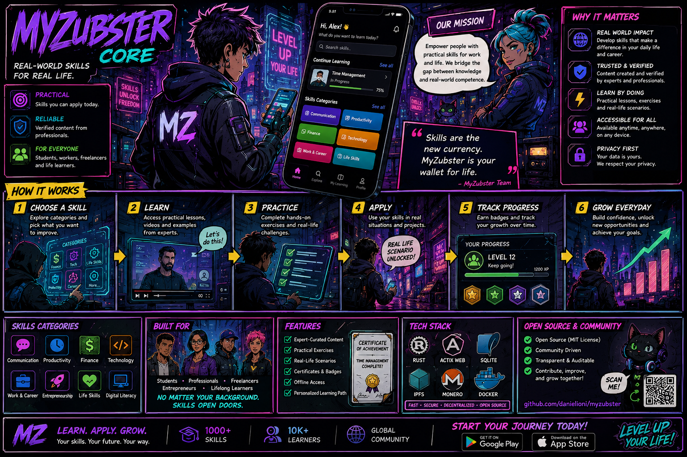

# MyZubster

<p align="center">
  
</p>

> **Open-source infrastructure for real-world observations, verifiable evidence, collaborative workflows, privacy-aware automation and reproducible pilots.**

MyZubster turns authorized real-world observations — photos, places, environmental data, services and technical contributions — into structured information that can be connected, reviewed, validated and reused.

**Current state:** MVP / active development and validation. Some components are operational, others experimental or in active implementation. A roadmap, issue, PR, merge, discussion or automated test is not by itself proof of deployment, partnership, adoption, funding or external payment.

## 🛡️ Automated software security — evidence-first CI

MyZubster uses GitHub-based automation to continuously check software changes and dependency risk. The objective is **not blind self-updating**: automation detects issues, proposes or validates changes, produces evidence and blocks unsafe candidates, while consequential merge/risk decisions remain subject to human review.

```text
CODE / DEPENDENCY CHANGE
          ↓
       PUSH / PR
          ↓
     GITHUB ACTIONS
          ↓
 REPRODUCIBLE INSTALL
          ↓
 TESTS + DEPENDENCY AUDIT
          ↓
 EXACT DEPENDENCY TREE
          ↓
 BUILD / EXPORT VALIDATION
          ↓
 SBOM + SECURITY EVIDENCE
          ↓
      SECURITY GATE
       ↙         ↘
    FAIL         PASS
     ↓             ↓
 BLOCK / FIX   REVIEW / MERGE
```

Security automation may include CI tests, `npm audit`, exact dependency-tree validation, build/export checks, SBOM generation and retained evidence artifacts. Dependabot/security tooling may detect vulnerable or outdated dependencies and propose pull requests; those proposals must still pass the applicable project gates before integration.

Key principles:

- **AUTOMATED CHECK ≠ SECURITY GUARANTEE** — a green workflow proves only the checks actually executed under the tested conditions;
- **LOWER SCANNER COUNT ≠ VALID REMEDIATION** — dependency compatibility, exact-tree validity, tests and relevant build/runtime checks still matter;
- **FAILED GATE → NO MERGE** for a candidate that does not satisfy required checks;
- major framework/runtime migrations are not auto-merged merely to reduce vulnerability counts;
- security evidence is versioned and reviewable so remediation decisions can be traced to concrete runs, artifacts and commits;
- human review remains required for material risk acceptance, production activation and other consequential decisions.

Current public security evidence is tracked in [`docs/PUBLIC-SECURITY-RESULTS-2026-08-29.md`](docs/PUBLIC-SECURITY-RESULTS-2026-08-29.md). Open findings remain findings until they are actually remediated and verified; automation must not represent an unresolved result as proof that the system is vulnerability-free.

## 🇮🇹 Public compliance-by-design — Italy / EU

MyZubster is **not** presented as automatically or universally legal merely because it is open source or because this README says so. The project instead adopts a verifiable **compliance-by-design** model: each real deployment must respect the laws, permissions, data rights, security requirements and sector-specific rules applicable to its actual use case.

The operating principle is:

> **Evidence before claims. Human responsibility before automation. Authorization before deployment.**

For MyZubster this means:

- **NO AUTHORIZATION → NO DEPLOYMENT** for third-party sites, infrastructure, systems or protected/non-public data;
- **NO EVIDENCE → NO CLAIM** for material project, pilot, partnership, validation or adoption statements;
- **REGULATED FEATURE → SEPARATE REVIEW** before activation;
- AI/automation may assist workflows but does not automatically replace required human responsibility or oversight;
- candidate pilots remain `CANDIDATE / PENDING AUTHORIZATION` until the relevant authorization and scope are evidenced;
- open DAO/community participation does not automatically create employment, payment, partnership, representation or authority to bind third parties;
- `MYZ`/token concepts remain separate from environmental evidence and operational responsibility, and any future regulated payment/crypto-asset functionality requires a dedicated assessment before activation;
- privacy, cybersecurity, intellectual property, workplace safety, environmental rules, cultural/archaeological heritage, public procurement, professional requirements and other sector-specific law remain applicable whenever relevant.

The Italian and EU reference framework includes **Italian Law 23 September 2025, no. 132** on artificial intelligence and **Regulation (EU) 2024/1689 (AI Act)**. MyZubster's position is not that technology is outside regulation; it is that authorization, evidence, human responsibility and applicable compliance gates must be satisfied before real-world use.

If a proposed function cannot lawfully be deployed, lacks a required authorization, or needs further regulatory assessment, the project must **block it, keep it in simulation/demo, or redesign it** until the relevant requirements are satisfied.

Public compliance statement: **[#840 — Why MyZubster is designed to operate lawfully in Italy](https://github.com/MyZubster-Ecosystem/myzubster/issues/840)**  
Public roadmap: **[#839 — MyZubster territorial AI, evidence-first DAO & pilot pathway](https://github.com/MyZubster-Ecosystem/myzubster/issues/839)**

> **Disclaimer:** this is a technical/governance commitment, not legal advice, a conformity assessment, certification, authorization, regulatory approval or institutional endorsement.

## 👤 Daniel Ioni — Founder & Builder

Daniel Ioni (`DanielIoni-creator`) is the creator and lead builder of **MyZubster**, an open digital ecosystem focused on interoperability, immersive experiences, open-source development and the emerging **MyZubster LIFE 2027** initiative.

Alongside MyZubster development, public contribution work includes upstream pull requests or contribution branches involving **Vircadia World**, **Decentraland JS SDK Toolchain**, **Monero Docs** and experimental **WebXR Samples** work.

The contribution-first workflow is:

```text
STUDY → FORK → BUILD → TEST → UPSTREAM PR → REVIEW → INTEROPERABILITY
```

Open pull requests and fork branches are independent open-source contributions; they do **not** imply partnership, endorsement, affiliation, acceptance upstream or formal contributor status with the respective projects.

## 🧭 Start here

| I want to… | Start here |
|---|---|
| Understand MyZubster | This README → **How MyZubster works** |
| Join the community | [`JOIN.md`](JOIN.md) |
| Contribute code/docs/design | [`CONTRIBUTING.md`](CONTRIBUTING.md) |
| Understand ecosystem architecture | [`docs/ECOSYSTEM.md`](docs/ECOSYSTEM.md) |
| Understand bounties | [`BOUNTIES.md`](BOUNTIES.md) |
| Understand internal rewards | [`REWARDS_LEDGER.md`](REWARDS_LEDGER.md) |
| Understand treasury boundaries | [`TREASURY.md`](TREASURY.md) |
| Read the XMR stagenet implementation status | [`docs/XMR-STAGENET-SETTLEMENT.md`](docs/XMR-STAGENET-SETTLEMENT.md) |
| See public community evidence | [`docs/PUBLIC-COMMUNITY-ACTIVITY.md`](docs/PUBLIC-COMMUNITY-ACTIVITY.md) |
| Submit independent evidence | [Community evidence issue #715](https://github.com/MyZubster-Ecosystem/myzubster/issues/715) |
| Follow globalization | [`docs/GLOBALIZATION_ROADMAP_2026_2028.md`](docs/GLOBALIZATION_ROADMAP_2026_2028.md) |
| Read multilingual docs | [`docs/i18n/README.md`](docs/i18n/README.md) |
| Follow public discovery/history | [`docs/PUBLIC-TIMELINE.md`](docs/PUBLIC-TIMELINE.md) |
| Explore documentation hub | [myzubster-docs](https://github.com/MyZubster-Ecosystem/myzubster-docs) |
| Read manuals | [myzubster-manuals](https://github.com/MyZubster-Ecosystem/myzubster-manuals) |
| Open the public website | [myzubster.com](https://www.myzubster.com/) |
| Explore DAO public area | [myzubster.com/dao](https://www.myzubster.com/dao) |
| Explore the Chronicle | [myzubster.com/fumetto](https://www.myzubster.com/fumetto) |

> 🌍 **Languages:** English · Italiano · Español · Français · Deutsch · Português · 中文 · 日本語 · 한국어 · العربية · हिन्दी · Русский · Türkçe · Bahasa Indonesia · Polski · Українська · বাংলা · اردو · فارسی · Kiswahili — see [`docs/i18n/README.md`](docs/i18n/README.md).

## ⚙️ How MyZubster works

```text
OBSERVE
   ↓
DOCUMENT
   ↓
CONNECT TO MAP / DATASET / MISSION
   ↓
COLLABORATE
   ↓
VERIFY EVIDENCE
   ↓
PUBLISH SANITIZED / AUTHORIZED OUTPUT
   ↓
REWARD ACCOUNTING
   ↓
OPTIONAL INDEPENDENT EXTERNAL SETTLEMENT
```

### 1 — Observe
A contributor records an authorized real-world observation: for example a public place, environmental measurement, plant, service, media contribution or technical test.

### 2 — Document
The observation is enriched with the information required by its workflow: timestamp, permitted location information, media, structured fields, source/provenance and supporting evidence.

### 3 — Connect
The record can be associated with mapping, a dataset, a project, a bounty/mission or another MyZubster workflow.

### 4 — Collaborate
Developers, researchers, designers, testers and other contributors can work through public issues and explicitly scoped tasks.

### 5 — Verify
Evidence is evaluated against stated acceptance criteria. A photo, issue, PR, CID, database row or automated output does **not** by itself prove successful completion.

### 6 — Publish
Only authorized and appropriately sanitized information should become public. Content-addressed publication through IPFS/IPNS is part of the ecosystem direction; confidential partner data and unnecessary personal information stay outside public datasets.

### 7 — Reward / settlement
`MYZ` currently represents internal reward/accounting logic. It must not automatically be represented as an on-chain payment. XMR or another external settlement mechanism is a separate boundary and requires actual independent verification.

## 🏗️ Architecture at a glance

```text
                    PEOPLE / CONTRIBUTORS
                             │
                    Web / App / GitHub
                             │
                             ▼
                      MYZUBSTER CORE
                ┌────────────┼────────────┐
                ▼            ▼            ▼
          Observations      Map       Missions/Bounties
                │            │            │
                └────────────┼────────────┘
                             ▼
                    Evidence / Provenance
                             │
                   ┌─────────┴─────────┐
                   ▼                   ▼
                Zorgax             Human Review
                   │                   │
                   └─────────┬─────────┘
                             ▼
                  Validated / Sanitized Output
                   ┌─────────┼─────────┐
                   ▼         ▼         ▼
               Dashboard   IPFS/IPNS  Reports
                             │
                  optional separate boundary
                             ▼
                Gateway / External Settlement
                             │
                             ▼
                   Independent Verifier
```

## 💸 XMR stagenet settlement — active implementation

MyZubster now has a concrete implementation track for the first **verifiable Monero stagenet settlement** in [`MyZubsterGateway`](https://github.com/MyZubster-Ecosystem/MyZubsterGateway).

Public implementation evidence:

- [`MyZubsterGateway#1403`](https://github.com/MyZubster-Ecosystem/MyZubsterGateway/issues/1403) — P0 implementation / E2E validation gate;
- [`MyZubsterGateway#1404`](https://github.com/MyZubster-Ecosystem/MyZubsterGateway/pull/1404) — runtime + tests for the first verifiable XMR stagenet path;
- [`docs/XMR-STAGENET-SETTLEMENT.md`](docs/XMR-STAGENET-SETTLEMENT.md) — canonical implementation-status document.

### Current runtime guarantees

The current Gateway implementation includes:

- **stagenet-only** gating for the first real E2E path;
- canonical positive integer **XMR atomic amount** handling;
- strict **64-hex TXID validation**;
- explicit separation between the transaction **submitter** and an **independent verifier**;
- submission logic that may produce `SUBMITTED`, but cannot self-declare `PAID`;
- fail-closed handling when verification is unavailable or invalid;
- recipient, amount, network and TXID consistency checks;
- minimum-confirmation enforcement;
- idempotent/replay-aware submission behavior;
- negative-path tests for malformed amount, wrong network, duplicate submit, missing verifier, verifier timeout, wrong recipient, wrong amount, wrong TXID and insufficient confirmations;
- a successful path to `PAID` only after independent evidence matches the expected settlement.

The settlement lifecycle is deliberately evidence-first:

```text
PENDING
  ↓
ACCEPTED
  ↓
SUBMITTED
  ↓
CONFIRMED
  ↓
PAID
```

Recovery/failure states may include `UNSETTLED`, `FAILED` and `DISPUTED`.

### Critical trust boundary

A wallet/provider response alone is **not** finality.

```text
AUTHORIZED SETTLEMENT INTENT
        ↓
SUBMITTER / WALLET RPC
        ↓
TXID
        ↓
INDEPENDENT VERIFIER
        ↓
MATCH NETWORK + RECIPIENT + AMOUNT + TXID + CONFIRMATIONS
        ↓
CONFIRMED
        ↓
PAID
```

If the verifier is unavailable, times out or returns inconsistent evidence, the settlement must remain non-final rather than inferring success.

### Automated validation status

On the current XMR implementation branch, the principal functional CI workflows have passed, including the main `CI`, `CI Boost`, quality and lint/typecheck checks. A separate performance workflow has reported a failure and is tracked independently rather than being represented as proof of settlement failure or success.

Automated tests prove behavior under the tested conditions. They do **not** prove that a real external transaction has already happened.

### Next gate: real stagenet E2E

The next milestone is to wire the runtime contracts to:

1. an authorized `monero-wallet-rpc` configured for **stagenet**;
2. a separately configured read-only / independent verification source;
3. one tiny-value real stagenet transaction;
4. a sanitized evidence package proving the lifecycle without publishing wallet seeds, private keys, passwords or other secrets.

Until that real transaction is executed and independently verified, the correct status is:

> **runtime + automated tests implemented; real stagenet transaction still pending validation.**

Mainnet is explicitly outside this milestone. Passing stagenet tests is not authorization to activate production/mainnet settlement.

## 🤖 Zorgax — automation boundary

Zorgax is the automation/orchestration track of MyZubster. Its intended role is to help with bounded processing such as routing, schema checks, normalization, provenance preparation, anomaly detection and draft evidence.

For environmental/LIFE-oriented workflows:

```text
AUTHORIZED DATA / SENSORS
          ↓
        INGEST
          ↓
     SCHEMA CHECK
          ↓
    NORMALIZATION
          ↓
      PROVENANCE
          ↓
    DRAFT EVIDENCE
          ↓
   TECHNICAL REVIEW
          ↓
   SCIENTIFIC REVIEW
          ↓
    VALIDATED KPI
          ↓
 DASHBOARD / REPORTABLE EVIDENCE
```

Zorgax must not invent missing measurements, silently approve scientific claims, publish restricted partner data, authorize consequential governance actions or replace required human review.

Implementation planning is tracked in **#713 — Zorgax LIFE Automation v1** and **#714 — ChatGPT × Zorgax v2 research/automation**.

## 🏛️ DAO / governance

MyZubster exposes a public DAO/governance area at [myzubster.com/dao](https://www.myzubster.com/dao).

```text
COMMUNITY INPUT
      ↓
PROPOSAL / EVIDENCE
      ↓
ZORGAX-ASSISTED PREPARATION
      ↓
HUMAN / GOVERNANCE REVIEW
      ↓
AUTHORIZED ACTION
```

Automation is assistance, not authority. Scientific validation, formal partnerships, treasury operations and other consequential decisions require explicit controls appropriate to the action.

## 🌍 Open Community

Public GitHub contribution does not require a private invitation. Contributors may participate using a public alias, subject to GitHub and project rules.

Contribution paths include:

- 🧑‍💻 **Develop** — code, tests, API, frontend/backend, DevOps, documentation;
- 🎨 **Create** — UX, visuals, characters, storytelling, translations;
- 📷 **Observe** — authorized/public observations and provenance-aware media;
- 🔬 **Research** — datasets, environment, IoT, GIS, privacy and technical verification;
- 🧪 **Test** — reproduce bugs and workflows, accessibility and usability;
- 🌎 **Participate** — start with [`JOIN.md`](JOIN.md) and a small public mission.

Participation is voluntary. A contribution, character, issue or PR does not automatically imply employment, partnership, payment or endorsement.

## 🤝 External upstream contributions

MyZubster follows a **contribute first, integrate second** approach when interacting with independent open-source ecosystems. These entries are public technical contributions or contribution branches; they do **not** imply partnership, endorsement, affiliation or adoption.

| Upstream project | Contribution | Public evidence | Current evidence status |
|---|---|---|---|
| **Vircadia World** | Documentation clarifying external integration boundaries, API separation, identity boundaries, licensing and reproducible provenance. | [vircadia/vircadia-world PR #17](https://github.com/vircadia/vircadia-world/pull/17) | **Upstream PR open / under review** |
| **Decentraland JS SDK Toolchain** | Fix preserving CRDT state-sync retries when a state response comes from a non-authoritative peer, with a regression test. | [decentraland/js-sdk-toolchain PR #1556](https://github.com/decentraland/js-sdk-toolchain/pull/1556) | **Upstream PR open / review required** |
| **Monero Docs** | Wallet RPC documentation clarification for the `get_transfers` `pending` parameter. | [monero-project/monero-docs PR #389](https://github.com/monero-project/monero-docs/pull/389) | **Upstream PR open / checks + review pending** |
| **Immersive Web / WebXR Samples** | Experimental `visibility-mask-change` sample work prepared in a fork branch. | [`feat/visibility-mask-change-sample`](https://github.com/DanielIoni-creator/webxr-samples/tree/feat/visibility-mask-change-sample) | **Fork branch prepared; no upstream PR claimed** |

```text
FORK / BRANCH
    ↓
UPSTREAM PR SUBMITTED
    ↓
UPSTREAM REVIEW
    ↓
UPSTREAM ACCEPTED / MERGED
```

Only the final state may be described as accepted upstream.

## 📊 Public evidence & adoption

MyZubster separates anonymous interest from attributable public participation and stronger adoption evidence.

```text
Website analytics
→ anonymous interest

GitHub PR / issue / review / reproducible test
→ attributable public participation

Independent reproduction / integration
→ stronger adoption evidence

Authorized real-world pilot
→ operational evidence
```

### Independent public discovery signals — 29 Aug 2026

A public discovery check identified two external signals that are kept separate from stronger adoption evidence:

- **ShipRadar** independently indexed MyZubster GitHub opportunities, including the External & LIFE Bounty Federation and the visual-comic bounty. This is evidence of third-party discovery/indexing outside MyZubster-owned channels; it is **not** evidence of payout, contributor conversion, partnership, endorsement or adoption.
- **Web Pulse** republished/syndicated a MyZubster article originally published on DEV. This is treated as a secondary distribution signal rather than independent editorial validation.

At the time of the check, production Web Analytics data were not available in a form sufficient to compare visitors, page views, landing pages, referrers/search, countries and devices against a recent baseline. Therefore no traffic spike or causal relationship is claimed.

**Next verification gate:** look for a material new referrer/search source associated with these external surfaces, or a temporally aligned increase in relevant DAO, bounty, contributor or Chronicle landing-page traffic. Causality should only be stated when supported by referral and timing evidence.

See [`docs/PUBLIC-COMMUNITY-ACTIVITY.md`](docs/PUBLIC-COMMUNITY-ACTIVITY.md) and submit reproducible external evidence through [issue #715](https://github.com/MyZubster-Ecosystem/myzubster/issues/715).

Passive visitors must not be deanonymized or correlated with GitHub identities without an explicit legitimate privacy-respecting basis.