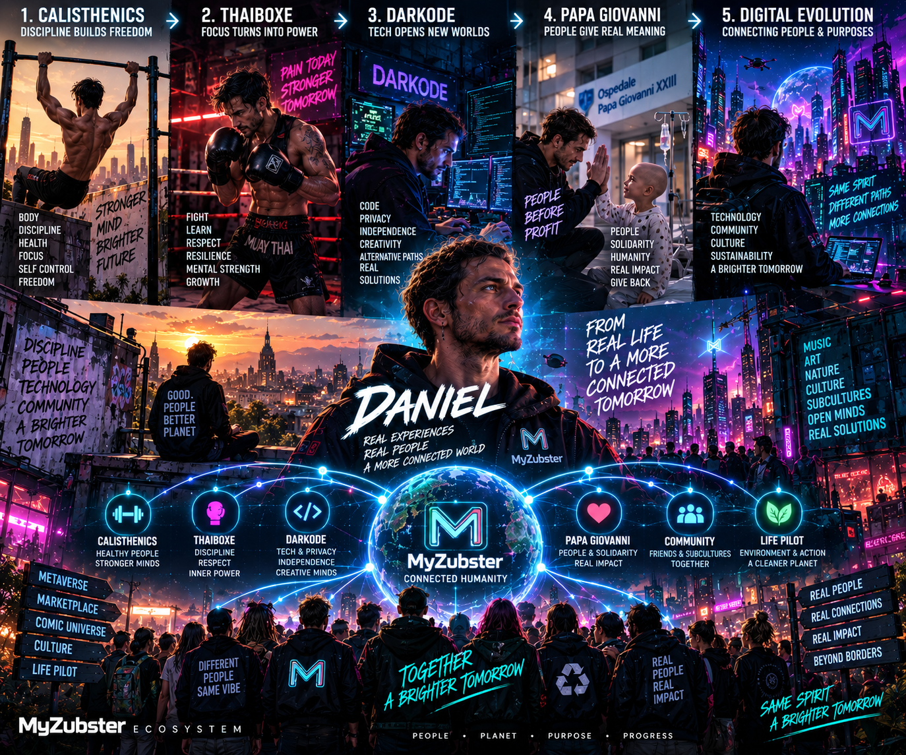
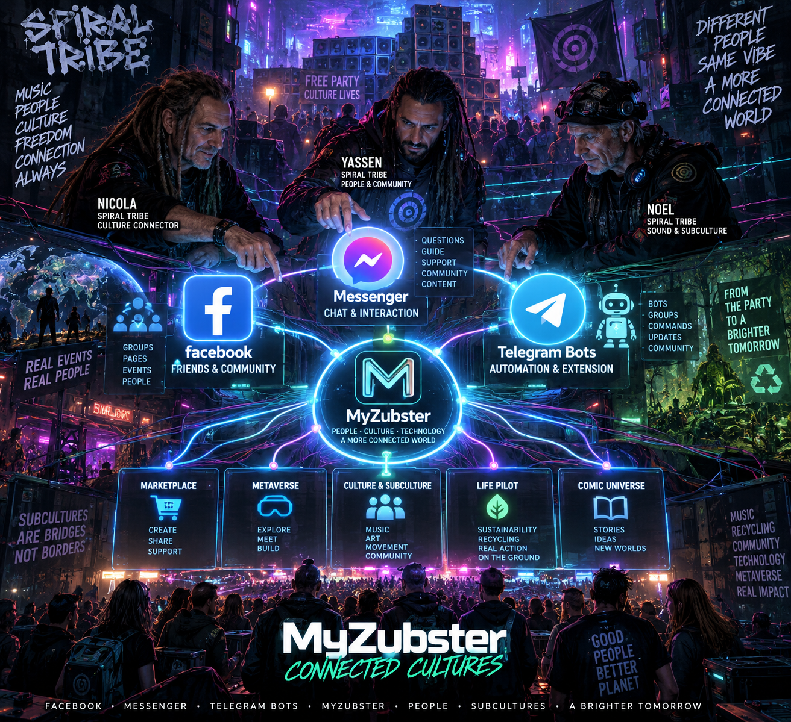

# Daniel Ioni — Creator & Builder

Daniel Ioni ([`DanielIoni-creator`](https://github.com/DanielIoni-creator)) is the creator and lead builder of **MyZubster**, an open digital ecosystem connecting open-source development, community channels, immersive experiences, cultural documentation, LIFE-oriented initiatives and the Zorgax conversational layer.

This page connects the public creator profile with the visual and technical paths currently documented in the MyZubster repository. It is a project profile, not evidence of third-party endorsement, institutional affiliation or membership in any external collective.

## Visual journey

<p align="center">
  
</p>

The visual represents a narrative path through **calisthenics → Thai boxing → Darkode/technology → Papa Giovanni/human solidarity → digital evolution and interconnected communities**. It should be read as an artistic representation of a personal/project journey, not as independent documentary proof of biographical events.

## Connected cultures visual

<p align="center">
  
</p>

This visual represents the multi-channel direction of the ecosystem: people can discover or communicate through different public channels while MyZubster remains the application layer and Zorgax provides conversational guidance.

## Daniel → MyZubster → connected communities

```text
DanielIoni-creator
        │
        ▼
     MyZubster
        │
        ├── Facebook Community
        │       ↓
        │    Messenger
        │       ↓
        │     Zorgax
        │
        ├── Telegram
        │      ├── @myzubster_bot
        │      └── @FlytekRaverBot
        │
        ├── Metaverse
        ├── Marketplace
        ├── LIFE / projects
        ├── Fumetto / Chronicle
        └── Culture / Subculture documentation
```

The architectural objective is not to create unrelated bots for every network. The intended direction is a shared MyZubster/Zorgax application core with channel-specific adapters.

## Public entry points

| Area | Public entry point |
|---|---|
| Daniel Ioni on GitHub | https://github.com/DanielIoni-creator |
| MyZubster | https://www.myzubster.com/ |
| Core repository | https://github.com/MyZubster-Ecosystem/myzubster |
| Messenger bridge status | https://www.myzubster.com/api/meta/messenger/status |
| Messenger webhook | https://www.myzubster.com/api/meta/messenger/webhook |
| MyZubster Telegram Bot | https://t.me/myzubster_bot |
| Flytek Raver Bot | https://t.me/FlytekRaverBot |
| Metaverse | https://www.myzubster.com/metaverse |
| Marketplace | https://www.myzubster.com/marketplace |
| Fumetto / Chronicle | https://www.myzubster.com/fumetto |

## Facebook Messenger bridge

The repository documents a Meta Messenger community bridge that connects the MyZubster Community messaging entry point with the production backend and Zorgax.

```text
FACEBOOK / MESSENGER
        ↓
META WEBHOOK
        ↓
MYZUBSTER PRODUCTION
        ↓
ZORGAX
        ↓
ROUTING / GUIDANCE
        ↓
MYZUBSTER ECOSYSTEM
```

Relevant documentation:

- [`FACEBOOK-MESSENGER-ZORGAX-FUMETTO.md`](FACEBOOK-MESSENGER-ZORGAX-FUMETTO.md)
- [`META_MESSENGER_ZORGAX_BRIDGE.md`](META_MESSENGER_ZORGAX_BRIDGE.md)
- [`META_MESSENGER_OPERATIONS_RUNBOOK.md`](META_MESSENGER_OPERATIONS_RUNBOOK.md)

## Telegram bots

The README currently documents two Telegram entry points as live:

- **MyZubster Bot** — `@myzubster_bot`, the main ecosystem bot and Zorgax conversational entry point.
- **Flytek Raver Bot** — `@FlytekRaverBot`, a dedicated community bot using MyZubster backend infrastructure while remaining logically isolated from the main bot.

The longer-term bridge design is documented in:

- [`TELEGRAM_ZORGAX_BRIDGE_PLAN.md`](TELEGRAM_ZORGAX_BRIDGE_PLAN.md)

```text
FACEBOOK / MESSENGER ─┐
TELEGRAM              ├──→ SHARED CHANNEL LAYER ─→ ZORGAX ─→ MYZUBSTER
WEB / FUMETTO         ┤
GITHUB                ┘
```

## Culture, Subculture and community continuity

MyZubster's cultural documentation explores how real-world communities can preserve public, consented and attributable material after an event or gathering without turning social authentication into unsupported historical claims.

```text
REAL-WORLD ACTIVITY
        ↓
PEOPLE / MUSIC / ART / COMMUNITY
        ↓
MESSENGER OR TELEGRAM
        ↓
ZORGAX
        ↓
MYZUBSTER
   ├── Culture / Subculture
   ├── Metaverse
   ├── LIFE / projects
   ├── Community
   └── Public documentation
```

Relevant cultural documentation:

- [`culture/MUSIC-SUBCULTURES-AND-SOUND-SYSTEMS.md`](culture/MUSIC-SUBCULTURES-AND-SOUND-SYSTEMS.md)
- [`culture/DIY-CULTURAL-DIALOGUE.md`](culture/DIY-CULTURAL-DIALOGUE.md)
- [`culture/CULTURAL-ORIGIN-CHRONICLE.md`](culture/CULTURAL-ORIGIN-CHRONICLE.md)

Authentication, testimony, historical verification, relationship confirmation and collective authorization remain separate concepts. A Facebook, Telegram, GitHub or MyZubster account does not by itself prove membership in, authority over, or endorsement by a cultural collective.

## Metaverse

The MyZubster Metaverse is one of the public destinations that Zorgax can help users discover.

```text
SOCIAL / COMMUNITY ENTRY POINT
        ↓
ZORGAX
        ↓
MYZUBSTER METAVERSE
        ↓
NAVIGABLE DIGITAL SPACE
```

Public route: https://www.myzubster.com/metaverse

The Metaverse can provide a digital continuation for public project, cultural, community or exhibition material where the underlying content and permissions support it.

## LIFE and real-world impact

The project also explores a bridge between digital coordination and real-world initiatives through LIFE-oriented work.

```text
DIGITAL CONNECTION
       ↓
COMMUNITY
       ↓
AUTHORIZED REAL-WORLD ACTIVITY
       ↓
OBSERVATION / EVIDENCE
       ↓
MYZUBSTER LIFE
       ↓
REVIEWABLE PUBLIC OUTPUT
```

Environmental or social-impact claims require actual evidence. A visual, bot interaction, repository commit or community message is not proof that a cleanup, measurement, intervention or institutional collaboration occurred.

## Fumetto / Chronicle

The **Fumetto / Chronicle** is a public narrative and visual entry point into the MyZubster ecosystem:

https://www.myzubster.com/fumetto

Narrative and concept artwork must remain distinguishable from real-world evidence. Zorgax should not convert fictional or conceptual material into factual claims.

## Open-source contribution path

Daniel's public MyZubster development is organized around a contribution-first workflow:

```text
STUDY
  ↓
FORK / BRANCH
  ↓
BUILD
  ↓
TEST
  ↓
PULL REQUEST
  ↓
REVIEW
  ↓
MERGE / INTEROPERABILITY WHEN ACCEPTED
```

Public upstream pull requests, forks or contribution branches are independent open-source contributions. They do not imply partnership, endorsement, affiliation, acceptance upstream or formal contributor status unless the relevant third party explicitly establishes that relationship.

## Visual assets

The two current social/creator visuals are versioned in the repository:

- [`MyZubster_Daniel_Cyberpunk_Evolution.png`](../public/images/social/MyZubster_Daniel_Cyberpunk_Evolution.png)
- [`MyZubster_Connected_Cultures_Facebook_Messenger_Telegram.png`](../public/images/social/MyZubster_Connected_Cultures_Facebook_Messenger_Telegram.png)

They are project communication assets. Their presence in the repository does not change the evidence status of any real-world claim depicted symbolically in the artwork.

## Core principle

```text
REAL PEOPLE
    +
REAL EXPERIENCES
    +
OPEN TECHNOLOGY
    +
CONSENTED CULTURAL MEMORY
    +
APPLICATION TRUTH
    +
CONNECTED COMMUNICATION CHANNELS
    ↓
MYZUBSTER
```

The objective is to use technology to preserve connections rather than replace human experience: social channels provide entry points, Zorgax provides guidance, MyZubster provides the application and documentation layer, and real-world claims remain subject to evidence, authorization and consent.
