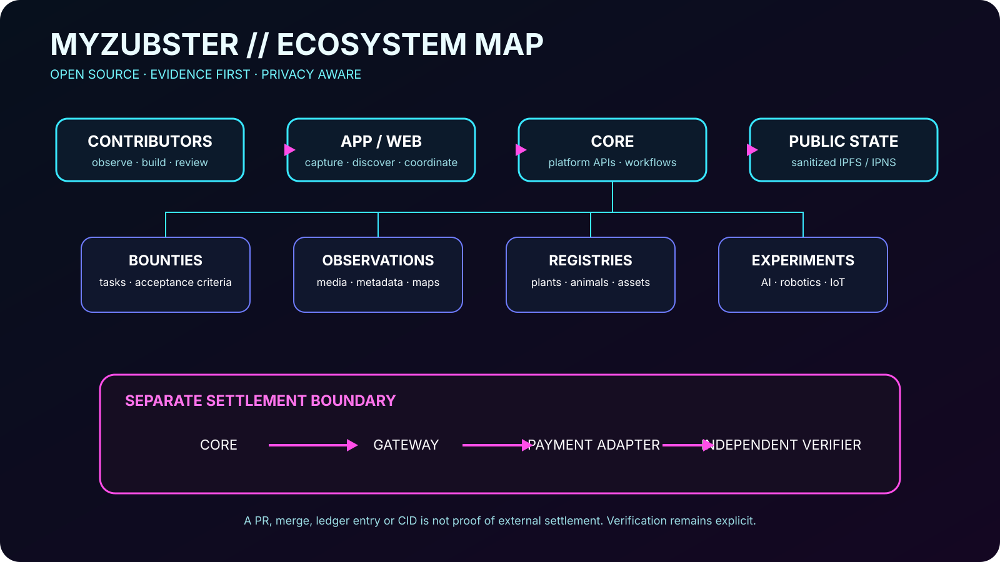
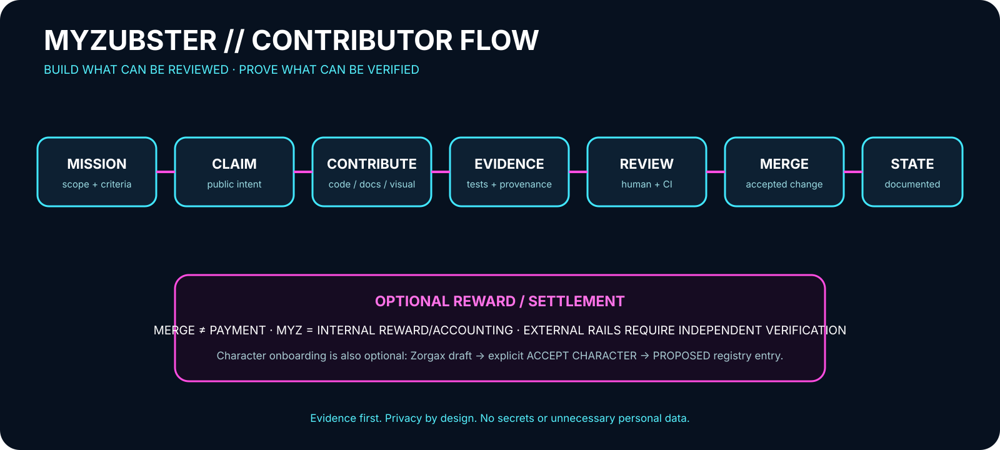
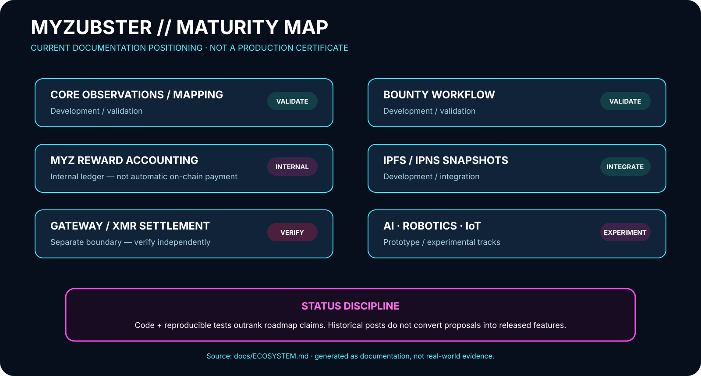

# MyZubster Visual Foundation

This page is the documentation home for the canonical visual foundation introduced in PR #618. The visuals summarize architecture, contributor/evidence flow and maturity positioning. They are documentation aids, not proof of real-world events, deployment, adoption, payment or partnership.

## Ecosystem architecture

`MYZ-VIS-008` mirrors the evidence-first architecture described in [`ECOSYSTEM.md`](ECOSYSTEM.md): contributors reach the core through app/web surfaces; observations, bounties and registries remain separate domain concerns; sanitized public state can be published through IPFS/IPNS; external settlement remains behind a separate gateway/payment/verifier boundary.

## Contributor and evidence flow

`MYZ-VIS-009` is a contributor-facing explanation. It intentionally states that merge is not payment and that MYZ is currently an internal reward/accounting mechanism. External settlement requires independent verification.

## Maturity map

`MYZ-VIS-010` prevents roadmap or experimental work from being mistaken for production. Code and reproducible tests remain higher-confidence evidence than roadmap text or historical posts.

## Chronicle narrative illustration

`MYZ-CHR-001` — `cronaca_cyberpunk_porta_galliana_pulita.png` — is a cyberpunk Chronicle illustration associated with the Porta Galliana cleanup narrative. It is classified as `NARRATIVE_ILLUSTRATION`, not photographic evidence. The archival copy is stored in the `MyZubster Zorgax Chronicle` Drive folder as file `1gdtpfiCTMX6tjx1xRC15hj5veG9Ray2f`.

The PNG is intentionally referenced by archival metadata rather than committed as binary through the current GitHub connector workflow. No Drive permissions are changed by this documentation.

## Evidence boundary

Use these classes consistently:

- `DOCUMENTATION_VISUAL` — diagrams and explanatory visual documentation derived from repository sources.
- `NARRATIVE_ILLUSTRATION` — fictionalized or stylized storytelling assets that may be inspired by a documented workflow but are not themselves evidence.
- real-world evidence — separately captured source material whose provenance and acceptance criteria are evaluated by the applicable workflow.

A diagram, illustration, issue, pull request, merge, CID or internal ledger entry must not be represented as proof of external settlement or a real-world event unless the required independent evidence exists.

## Source and provenance registry

Stable IDs, source documents, generation notes and archive state are maintained in [`../assets/visual/README.md`](../assets/visual/README.md).
