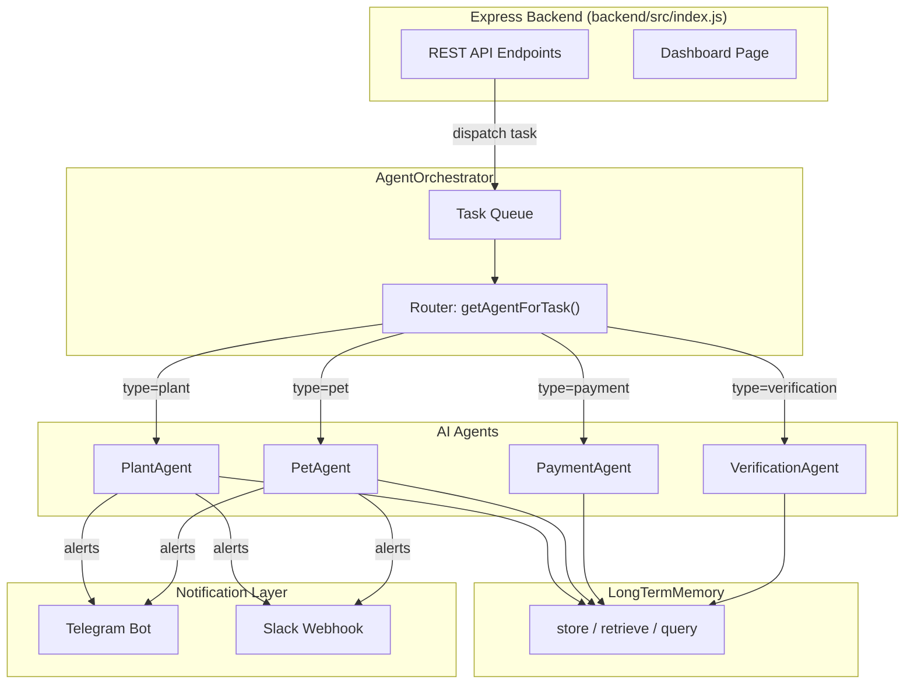

# MyZubster AI Automation System — API & Architecture Documentation

> **Issue #50** · Comprehensive reference for all backend API endpoints, AI agent classes, orchestrator patterns, notification integrations, and environment configuration.

---

## Table of Contents

- [1. Architecture Overview / 架构概览](#1-architecture-overview)
- [2. Express Backend API / Express 后端 API](#2-express-backend-api)
- [3. AI Orchestrator / AI 编排器](#3-ai-orchestrator)
- [4. PlantAgent / 植物智能体](#4-plantagent)
- [5. PetAgent / 宠物智能体](#5-petagent)
- [6. PaymentAgent / 支付智能体](#6-paymentagent)
- [7. VerificationAgent / 验证智能体](#7-verificationagent)
- [8. LongTermMemory / 长期记忆](#8-longtermmemory)
- [9. Notifications / 通知机制](#9-notifications)
- [10. Environment Configuration / 环境配置](#10-environment-configuration)

---

## 1. Architecture Overview / 架构概览



**Key Design Principles / 关键设计原则：**

- **Orchestrator Pattern** — A central `AgentOrchestrator` manages a task queue and routes each task to the appropriate specialized agent based on `task.type`.
- **Agent Independence** — Each agent (`PlantAgent`, `PetAgent`, `PaymentAgent`, `VerificationAgent`) is self-contained with its own skills, configuration, retry logic, and timeout handling.
- **Shared Memory** — All agents can persist and retrieve state through `LongTermMemory`, enabling cross-session continuity (e.g., remembering plant growth history).
- **Dual Notification** — Alerts and recovery messages are delivered via Telegram (primary) or Slack (if configured), with automatic fallback.

---

## 2. Express Backend API / Express 后端 API

**Base URL:** `http://localhost:3000` (default `PORT`)

---

### `GET /health` — Health Check / 健康检查

Returns the service health status.

**Response:**

```json
{
  "success": true,
  "message": "Service is healthy"
}
```

**Example:**

```bash
curl http://localhost:3000/health
```

---

### `POST /api/messages` — Send a Message / 发送消息

Sends a message between two users.

**Request Body:**

| Field        | Type   | Required | Description / 说明          |
|-------------|--------|----------|----------------------------|
| `senderId`  | string | ✅       | Sender user ID / 发送者 ID  |
| `receiverId`| string | ✅       | Receiver user ID / 接收者 ID |
| `content`   | string | ✅       | Message content / 消息内容   |

**Example:**

```bash
curl -X POST http://localhost:3000/api/messages \
  -H "Content-Type: application/json" \
  -d '{"senderId":"user_001","receiverId":"user_002","content":"Hello!"}'
```

```javascript
const res = await fetch('http://localhost:3000/api/messages', {
  method: 'POST',
  headers: { 'Content-Type': 'application/json' },
  body: JSON.stringify({
    senderId: 'user_001',
    receiverId: 'user_002',
    content: 'Hello!'
  })
});
const data = await res.json();
```

---

### `GET /api/messages/:userId` — Get All Messages for a User / 获取用户所有消息

Retrieves all messages where the specified user is either sender or receiver.

**Path Parameters:**

| Param     | Type   | Description / 说明     |
|-----------|--------|------------------------|
| `userId`  | string | Target user ID / 目标用户 ID |

**Example:**

```bash
curl http://localhost:3000/api/messages/user_001
```

---

### `GET /api/messages/:userId/:otherUserId` — Get Conversation / 获取两人对话

Retrieves all messages exchanged between two specific users.

**Path Parameters:**

| Param        | Type   | Description / 说明        |
|-------------|--------|---------------------------|
| `userId`     | string | First user ID / 用户 A     |
| `otherUserId`| string | Second user ID / 用户 B    |

**Example:**

```bash
curl http://localhost:3000/api/messages/user_001/user_002
```

---

### `PUT /api/messages/:messageId/read` — Mark as Read / 标记已读

Marks a specific message as read.

**Path Parameters:**

| Param        | Type   | Description / 说明         |
|-------------|--------|----------------------------|
| `messageId`  | string | Message ID / 消息 ID       |

**Example:**

```bash
curl -X PUT http://localhost:3000/api/messages/msg_abc123/read
```

---

### `GET /api/dashboard` — Dashboard Data / 仪表盘数据

Returns structured dashboard data including services, recent issues, and active bounties.

**Response:**

```json
{
  "services": [ /* ... */ ],
  "recentIssues": [ /* ... */ ],
  "activeBounties": [ /* ... */ ]
}
```

**Example:**

```bash
curl http://localhost:3000/api/dashboard
```

---

### `GET /dashboard` — Dashboard Page / 仪表盘 HTML 页面

Returns an HTML page that displays the dashboard with auto-refresh capability. This is the browser-facing dashboard view.

---

## 3. AI Orchestrator / AI 编排器

**File:** `src/agents/orchestrator/agentOrchestrator.js`

The `AgentOrchestrator` is the central coordination hub. It receives tasks, maintains a priority queue, routes each task to the correct agent, and manages retries and timeouts.

### Constructor

```javascript
const orchestrator = new AgentOrchestrator({
  plantAgent,          // PlantAgent instance
  petAgent,            // PetAgent instance
  paymentAgent,        // PaymentAgent instance
  verificationAgent,   // VerificationAgent instance
  memory,              // LongTermMemory instance
  maxConcurrentTasks,  // Max parallel tasks (number)
  taskTimeout,         // Per-task timeout in ms (number)
  retryAttempts        // Max retries on failure (number)
});
```

### Methods

#### `executeTask(task)` — Execute a Task / 执行任务

Dispatches a task to the appropriate agent and returns the result.

**Parameters:**

| Field    | Type   | Description / 说明              |
|----------|--------|---------------------------------|
| `task`   | object | Task descriptor                 |
| `task.type`    | string | Task type (e.g. `"plant"`, `"pet"`, `"payment"`, `"verification"`) |
| `task.data`    | object | Type-specific payload           |
| `task.priority`| number | Queue priority (higher = earlier)|

**Returns:** Agent-specific result object.

```javascript
const result = await orchestrator.executeTask({
  type: 'plant',
  data: { photo: photoBuffer },
  priority: 1
});
// → { success: true, confidence: 0.95, species: "Monstera deliciosa", ... }
```

#### `getAgentForTask(type)` — Route to Agent / 路由到智能体

Returns the agent instance responsible for the given task type.

```javascript
const agent = orchestrator.getAgentForTask('pet');
// → PetAgent instance
```

#### `addTaskToQueue(task)` — Enqueue Task / 入队任务

Adds a task to the priority queue without immediately executing it.

#### `processQueue()` — Process Queue / 处理队列

Sequentially dequeues and executes pending tasks respecting `maxConcurrentTasks`.

#### `getStatus()` — Get Orchestrator Status / 获取编排器状态

**Returns:**

```json
{
  "agents": { "plant": "active", "pet": "active", "payment": "active", "verification": "active" },
  "activeTasks": 2,
  "queueLength": 5,
  "memory": { "entries": 1230, "hitRate": 0.87 },
  "config": { "maxConcurrentTasks": 4, "taskTimeout": 30000, "retryAttempts": 3 }
}
```

---

## 4. PlantAgent / 植物智能体

**File:** `src/agents/skills/plantAgent.js`

Handles all plant-related AI operations: identification, growth monitoring, registration verification, and conservation impact assessment.

### Constructor

```javascript
const plantAgent = new PlantAgent({
  recognition,          // Plant recognition skill module
  monitoring,           // Growth monitoring skill module
  verification,         // Plant verification skill module
  conservation,         // Conservation impact skill module
  memory,               // LongTermMemory instance
  confidenceThreshold,  // Minimum confidence to accept results (number, 0–1)
  maxRetries,           // Max retry attempts (number)
  timeout               // Per-operation timeout in ms (number)
});
```

### Methods

#### `identifyPlant(photo, options)` — Identify a Plant / 识别植物

Analyzes a photo to identify the plant species.

**Parameters:**

| Param    | Type           | Description / 说明                  |
|----------|----------------|-------------------------------------|
| `photo`  | Buffer / string | Plant photo data / 植物照片数据     |
| `options`| object         | Optional recognition options        |

**Returns:**

```json
{
  "success": true,
  "confidence": 0.95,
  "species": "Monstera deliciosa",
  "commonName": "Swiss Cheese Plant",
  "photo": "<hash>",
  "timestamp": "2025-07-31T12:00:00.000Z"
}
```

**Example:**

```javascript
const fs = require('fs');
const photo = fs.readFileSync('./plant-photo.jpg');
const result = await plantAgent.identifyPlant(photo, { language: 'zh' });
console.log(`Identified: ${result.commonName} (${result.species})`);
```

---

#### `monitorGrowth(plantId, options)` — Monitor Plant Growth / 监测植物生长

Tracks growth metrics for a registered plant over time.

**Parameters:**

| Param     | Type   | Description / 说明            |
|-----------|--------|-------------------------------|
| `plantId` | string | Registered plant ID / 植物 ID |
| `options` | object | Optional monitoring options   |

**Returns:**

```json
{
  "success": true,
  "plantId": "plant_xyz",
  "height": 24.5,
  "health": "excellent",
  "growthRate": 1.2,
  "photos": ["<hash1>", "<hash2>"],
  "timestamp": "2025-07-31T12:00:00.000Z"
}
```

---

#### `verifyPlant(registrationData)` — Verify Plant Registration / 验证植物注册

Validates the authenticity of a plant registration submission.

**Parameters:**

| Param              | Type   | Description / 说明                 |
|-------------------|--------|-------------------------------------|
| `registrationData`| object | Registration payload including photo and metadata |

**Returns:**

```json
{
  "success": true,
  "verified": true,
  "confidence": 0.88,
  "data": { /* verified registration details */ },
  "timestamp": "2025-07-31T12:00:00.000Z"
}
```

---

#### `calculateConservationImpact(plantId)` — Conservation Impact / 计算保护影响

Estimates the environmental conservation contribution of a registered plant.

**Parameters:**

| Param     | Type   | Description / 说明       |
|-----------|--------|--------------------------|
| `plantId` | string | Registered plant ID      |

**Returns:**

```json
{
  "success": true,
  "plantId": "plant_xyz",
  "carbonOffset": 12.4,
  "biodiversity": 0.72,
  "waterConservation": 8.1,
  "timestamp": "2025-07-31T12:00:00.000Z"
}
```

---

#### `hashPhoto(photo)` — Hash a Photo / 照片哈希

Computes a SHA-256 hash of the provided photo for deduplication and integrity checks.

**Parameters:**

| Param   | Type           | Description / 说明  |
|---------|----------------|----------------------|
| `photo` | Buffer / string | Photo data           |

**Returns:** `string` — SHA-256 hex digest.

```javascript
const hash = plantAgent.hashPhoto(photoBuffer);
// → "a3f2b8c1d4e5f6a7b8c9d0e1f2a3b4c5d6e7f8a9b0c1d2e3f4a5b6c7d8e9f0a1"
```

---

#### `getStatus()` — Agent Status / 智能体状态

Returns the current operational status of the PlantAgent including skill readiness and memory stats.

---

## 5. PetAgent / 宠物智能体

**File:** `src/agents/skills/petAgent.js`

Manages pet-related operations: NFC identification, GPS tracking, health monitoring, and lost-pet recovery.

### Constructor

```javascript
const petAgent = new PetAgent({
  nfcReading,           // NFC reading skill module
  gpsTracking,          // GPS tracking skill module
  healthMonitoring,     // Health monitoring skill module
  lostPetRecovery,      // Lost pet recovery skill module
  trackingInterval,     // GPS polling interval in ms (number)
  maxRetries,           // Max retry attempts (number)
  timeout               // Per-operation timeout in ms (number)
});
```

### Methods

#### `readNfcTag(nfcId)` — Read NFC Tag / 读取 NFC 标签

Reads pet identification data from an NFC tag.

**Parameters:**

| Param  | Type   | Description / 说明       |
|--------|--------|--------------------------|
| `nfcId`| string | NFC tag identifier       |

**Returns:**

```json
{
  "success": true,
  "nfcId": "NFC_0042",
  "petId": "pet_dog_01",
  "name": "Lucky",
  "species": "dog",
  "breed": "Golden Retriever",
  "timestamp": "2025-07-31T12:00:00.000Z"
}
```

**Example:**

```javascript
const info = await petAgent.readNfcTag('NFC_0042');
if (info.success) {
  console.log(`Found pet: ${info.name} (${info.breed})`);
}
```

---

#### `trackLocation(petId, options)` — Track Pet Location / 追踪宠物位置

Returns the current GPS coordinates of a tracked pet.

**Parameters:**

| Param    | Type   | Description / 说明       |
|----------|--------|--------------------------|
| `petId`  | string | Pet identifier           |
| `options`| object | Optional tracking params |

**Returns:**

```json
{
  "success": true,
  "petId": "pet_dog_01",
  "lat": 31.2304,
  "lng": 121.4737,
  "accuracy": 5.2,
  "timestamp": "2025-07-31T12:00:00.000Z"
}
```

---

#### `monitorHealth(petId, options)` — Monitor Pet Health / 监测宠物健康

Retrieves health records and status for a pet.

**Parameters:**

| Param    | Type   | Description / 说明       |
|----------|--------|--------------------------|
| `petId`  | string | Pet identifier           |
| `options`| object | Optional health params   |

**Returns:**

```json
{
  "success": true,
  "petId": "pet_dog_01",
  "vaccinations": ["rabies", "distemper", "parvovirus"],
  "visits": 12,
  "medications": ["heartworm prevention"],
  "lastCheckup": "2025-06-15",
  "timestamp": "2025-07-31T12:00:00.000Z"
}
```

---

#### `lostPetRecovery(petId, options)` — Lost Pet Recovery / 走失宠物寻回

Initiates a lost-pet recovery protocol with geofence alerts and community notifications.

**Parameters:**

| Param    | Type   | Description / 说明               |
|----------|--------|----------------------------------|
| `petId`  | string | Pet identifier                   |
| `options`| object | Optional params (e.g. `radius`)  |

**Returns:**

```json
{
  "success": true,
  "petId": "pet_dog_01",
  "status": "searching",
  "radius": 5000,
  "alert": "Lost pet alert sent to 342 community members",
  "timestamp": "2025-07-31T12:00:00.000Z"
}
```

---

#### `getStatus()` — Agent Status / 智能体状态

Returns the current operational status of the PetAgent.

---

## 6. PaymentAgent / 支付智能体

**File:** `src/agents/skills/paymentAgent.js`

Handles Monero (XMR) payment processing, fee calculation, reward distribution, and fraud detection.

### Constructor

```javascript
const paymentAgent = new PaymentAgent({
  xmrProcessing,        // XMR transaction processing skill
  feeCalculation,       // Fee calculation skill
  rewardDistribution,   // Reward distribution skill
  fraudDetection,       // Fraud detection skill
  feeStructure: {       // Fee breakdown (numbers, e.g. fractions)
    creator,            //   creator share
    conservation,       //   conservation share
    operations          //   operations share
  },
  minAmount,            // Minimum transaction amount (number)
  maxRetries,           // Max retry attempts (number)
  timeout               // Per-operation timeout in ms (number)
});
```

### Methods

#### `processXMRTransaction(toAddress, amount, memo)` — Process XMR Payment / 处理门罗币交易

Sends a Monero transaction to the specified address.

**Parameters:**

| Param       | Type   | Description / 说明          |
|-------------|--------|-----------------------------|
| `toAddress` | string | Recipient XMR wallet address|
| `amount`    | number | Amount in XMR               |
| `memo`      | string | Transaction memo / 附言     |

**Returns:**

```json
{
  "success": true,
  "txId": "tx_abc123def456",
  "amount": 1.5,
  "fee": 0.001,
  "timestamp": "2025-07-31T12:00:00.000Z"
}
```

**Example:**

```javascript
const tx = await paymentAgent.processXMRTransaction(
  '4AdUnWnv3EzF…',  // recipient address
  2.5,                // amount in XMR
  'Bounty reward for issue #42'
);
console.log(`TX confirmed: ${tx.txId}`);
```

---

#### `calculateFees(amount)` — Calculate Fees / 计算手续费

Breaks down a transaction amount into creator, conservation, and operations fees.

**Parameters:**

| Param    | Type   | Description / 说明              |
|----------|--------|---------------------------------|
| `amount` | number | Transaction amount in XMR       |

**Returns:**

```json
{
  "success": true,
  "creator": 0.15,
  "conservation": 0.05,
  "operations": 0.03,
  "total": 0.23,
  "timestamp": "2025-07-31T12:00:00.000Z"
}
```

---

#### `distributeReward(projectId, totalReward, contributors)` — Distribute Rewards / 分配奖励

Distributes a pool of XMR rewards among multiple contributors.

**Parameters:**

| Param          | Type   | Description / 说明               |
|---------------|--------|----------------------------------|
| `projectId`   | string | Project / bounty identifier      |
| `totalReward` | number | Total reward pool in XMR         |
| `contributors`| array  | List of contributor objects with share weights |

**Returns:**

```json
{
  "success": true,
  "projectId": "bounty_042",
  "distributions": [
    { "userId": "user_001", "amount": 1.0 },
    { "userId": "user_002", "amount": 0.5 }
  ],
  "timestamp": "2025-07-31T12:00:00.000Z"
}
```

---

#### `detectFraud(transactionData)` — Detect Fraud / 检测欺诈

Analyzes a transaction for suspicious patterns and risk factors.

**Parameters:**

| Param             | Type   | Description / 说明                |
|------------------|--------|------------------------------------|
| `transactionData`| object | Transaction details to analyze     |

**Returns:**

```json
{
  "success": true,
  "riskScore": 0.12,
  "flags": [],
  "timestamp": "2025-07-31T12:00:00.000Z"
}
```

---

#### `getStatus()` — Agent Status / 智能体状态

Returns the current operational status of the PaymentAgent.

---

## 7. VerificationAgent / 验证智能体

**File:** `src/agents/skills/verificationAgent.js`

Provides multi-layer verification for plants, pets, community votes, and content quality scoring.

### Constructor

```javascript
const verificationAgent = new VerificationAgent({
  plantVerification,    // Plant verification skill
  petVerification,      // Pet verification skill
  communityVoting,      // Community voting skill
  votingThreshold,      // Approval threshold (number, 0–1)
  minVotes,             // Minimum votes required (number)
  maxRetries,           // Max retry attempts (number)
  timeout               // Per-operation timeout in ms (number)
});
```

### Methods

#### `verifyPlant(plantData)` — Verify Plant / 验证植物

Runs the full plant verification pipeline (photo analysis, species match, duplicate check).

**Parameters:**

| Param       | Type   | Description / 说明           |
|------------|--------|------------------------------|
| `plantData`| object | Plant registration data      |

**Returns:**

```json
{
  "success": true,
  "verified": true,
  "confidence": 0.92,
  "details": { /* verification breakdown */ },
  "timestamp": "2025-07-31T12:00:00.000Z"
}
```

**Example:**

```javascript
const result = await verificationAgent.verifyPlant({
  photo: photoBuffer,
  species: "Ficus benjamina",
  location: { lat: 31.23, lng: 121.47 }
});
if (result.verified) {
  console.log(`Plant verified with ${result.confidence * 100}% confidence`);
}
```

---

#### `verifyPet(petData)` — Verify Pet / 验证宠物

Verifies pet registration data against NFC records and community confirmations.

**Parameters:**

| Param     | Type   | Description / 说明        |
|-----------|--------|---------------------------|
| `petData` | object | Pet registration data     |

**Returns:**

```json
{
  "success": true,
  "verified": true,
  "confidence": 0.89,
  "details": { /* verification breakdown */ },
  "timestamp": "2025-07-31T12:00:00.000Z"
}
```

---

#### `analyzeCommunityVotes(itemId, votes)` — Analyze Votes / 分析社区投票

Aggregates community votes to determine approval status for an item.

**Parameters:**

| Param    | Type   | Description / 说明             |
|----------|--------|--------------------------------|
| `itemId` | string | Item identifier to vote on     |
| `votes`  | array  | Array of vote objects           |

**Returns:**

```json
{
  "success": true,
  "itemId": "plant_reg_007",
  "totalVotes": 15,
  "approved": 12,
  "rejected": 3,
  "score": 0.8,
  "timestamp": "2025-07-31T12:00:00.000Z"
}
```

---

#### `calculateQualityScore(content)` — Quality Score / 计算内容质量分

Evaluates the quality of submitted content (e.g., photo clarity, metadata completeness).

**Parameters:**

| Param     | Type   | Description / 说明        |
|-----------|--------|---------------------------|
| `content` | object | Content to evaluate       |

**Returns:**

```json
{
  "success": true,
  "score": 0.85,
  "factors": [
    { "name": "photo_quality", "weight": 0.4, "value": 0.9 },
    { "name": "metadata_completeness", "weight": 0.3, "value": 0.8 },
    { "name": "uniqueness", "weight": 0.3, "value": 0.85 }
  ],
  "timestamp": "2025-07-31T12:00:00.000Z"
}
```

---

#### `calculateFallbackScore(itemId, factors)` — Fallback Score / 降级评分

Calculates a quality score using pre-computed factors when the primary pipeline is unavailable.

**Parameters:**

| Param    | Type   | Description / 说明           |
|----------|--------|------------------------------|
| `itemId` | string | Item identifier              |
| `factors`| array  | Pre-computed factor objects  |

**Returns:**

```json
{
  "success": true,
  "itemId": "plant_reg_007",
  "score": 0.78,
  "factors": [ /* ... */ ],
  "timestamp": "2025-07-31T12:00:00.000Z"
}
```

---

#### `getStatus()` — Agent Status / 智能体状态

Returns the current operational status of the VerificationAgent.

---

## 8. LongTermMemory / 长期记忆

**File:** `src/agents/memory/longTermMemory.js`

A TTL-aware in-memory cache shared across all agents, used to persist recognition results, health histories, transaction logs, and verification records.

### Constructor

```javascript
const memory = new LongTermMemory({
  ttl,              // Time-to-live in ms for cached entries (number)
  maxSize,          // Maximum entries before eviction (number)
  cleanupInterval   // Periodic cleanup interval in ms (number)
});
```

### Methods

#### `store(key, value, metadata)` — Store Memory / 存储记忆

Persists a key-value pair with optional metadata.

**Parameters:**

| Param      | Type   | Description / 说明          |
|-----------|--------|-----------------------------|
| `key`     | string | Unique identifier           |
| `value`   | any    | Data to store               |
| `metadata`| object | Optional (e.g. `{ source: "plantAgent", type: "identification" }`) |

```javascript
await memory.store('plant:xyz:identification', {
  species: 'Monstera deliciosa',
  confidence: 0.95
}, { source: 'plantAgent', type: 'identification' });
```

#### `retrieve(key)` — Retrieve Memory / 检索记忆

Returns the stored value for a key, or `null` if expired / not found.

```javascript
const data = await memory.retrieve('plant:xyz:identification');
```

#### `query(filter)` — Query Memories / 查询记忆

Searches stored memories matching a filter object.

```javascript
const results = await memory.query({ source: 'petAgent', type: 'health' });
```

#### `delete(key)` — Delete Memory / 删除记忆

Removes a specific key from the cache.

#### `clearCache()` — Clear All / 清空缓存

Removes all entries from memory.

#### `getStats()` — Memory Stats / 记忆统计

Returns cache statistics (size, hit rate, eviction count, etc.).

```json
{
  "entries": 1230,
  "hitRate": 0.87,
  "totalHits": 4521,
  "totalMisses": 679,
  "evictions": 42
}
```

---

## 9. Notifications / 通知机制

MyZubster supports two notification channels with automatic fallback:

| Channel  | Configuration / 配置                      | Trigger               |
|----------|-------------------------------------------|------------------------|
| **Telegram** | `TELEGRAM_BOT_TOKEN` + `TELEGRAM_CHAT_ID` | Primary / 主通道       |
| **Slack**    | `SLACK_WEBHOOK_URL`                       | Preferred if configured / 优先 |

### Channel Selection Logic / 渠道选择逻辑

```
if (SLACK_WEBHOOK_URL is set) {
  → Use Slack
} else if (TELEGRAM_BOT_TOKEN and TELEGRAM_CHAT_ID are set) {
  → Use Telegram
} else {
  → No notifications (silent)
}
```

### Example: Sending a Notification

```javascript
// When an agent detects a critical event (e.g. lost pet, fraud alert),
// the notification layer automatically picks the configured channel.

// Telegram message format:
// Bot sends text message to TELEGRAM_CHAT_ID

// Slack message format:
// POST to SLACK_WEBHOOK_URL with JSON payload:
{
  "text": "🚨 Lost pet alert: Lucky (Golden Retriever) last seen at 31.23°N, 121.47°E"
}
```

---

## 10. Environment Configuration / 环境配置

All configuration is managed through environment variables. Create a `.env` file in the project root:

```env
# ─── Core / 核心 ──────────────────────────────────
MONGODB_URI=mongodb://127.0.0.1:27017/myzubster   # MongoDB connection string
PORT=3000                                           # Express server port

# ─── Telegram Notifications / Telegram 通知 ──────
TELEGRAM_BOT_TOKEN=your-bot-token-here
TELEGRAM_CHAT_ID=your-chat-id-here

# ─── Slack Notifications / Slack 通知 ────────────
SLACK_WEBHOOK_URL=https://hooks.slack.com/services/T.../B.../xxx
```

### Variable Reference / 变量参考

| Variable            | Required | Default                              | Description / 说明                          |
|--------------------|----------|--------------------------------------|---------------------------------------------|
| `MONGODB_URI`      | No       | `mongodb://127.0.0.1:27017/myzubster` | MongoDB connection string / 连接字符串       |
| `PORT`             | No       | `3000`                               | Express server port / 服务端口              |
| `TELEGRAM_BOT_TOKEN`| No      | —                                    | Telegram Bot API token / Telegram 机器人令牌 |
| `TELEGRAM_CHAT_ID`  | No      | —                                    | Target Telegram chat ID / 目标聊天 ID       |
| `SLACK_WEBHOOK_URL` | No      | —                                    | Slack Incoming Webhook URL / Slack Webhook   |

> **Note / 注意:** Notifications are optional. If neither Telegram nor Slack credentials are configured, the system operates silently without sending alerts.

---

## Quick Reference: Agent Task Routing / 智能体任务路由速查

| `task.type`       | Agent Dispatched     | File Location                                  |
|-------------------|----------------------|------------------------------------------------|
| `"plant"`         | `PlantAgent`         | `src/agents/skills/plantAgent.js`              |
| `"pet"`           | `PetAgent`           | `src/agents/skills/petAgent.js`                |
| `"payment"`       | `PaymentAgent`       | `src/agents/skills/paymentAgent.js`            |
| `"verification"`  | `VerificationAgent`  | `src/agents/skills/verificationAgent.js`       |

---

*Generated for [MyZubster](https://github.com/foxxx009/myzubster) — Issue #50*
