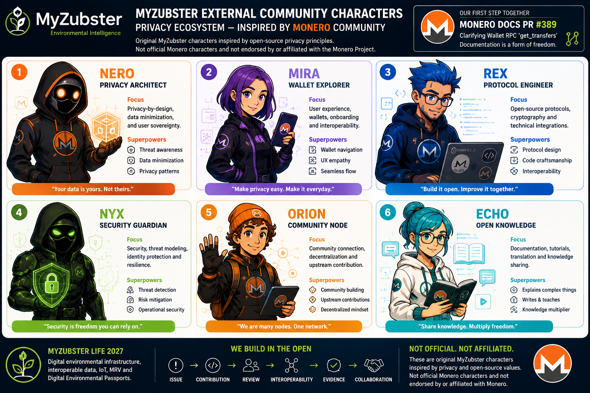

# MyZubster External Community Characters — Privacy Ecosystem

> **Unofficial / not affiliated.** These are original MyZubster fictional characters inspired by general open-source privacy, security, decentralization and community-contribution principles. They are **not official Monero characters**, are not endorsed by the Monero Project, and do not imply partnership, affiliation or participation in MyZubster LIFE 2027.

## Purpose

This character set provides a narrative and educational layer for MyZubster's external-community exploration. The characters may be used to explain privacy-aware architecture, wallet concepts, protocol engineering, security, decentralized collaboration and open documentation without representing external projects or communities as MyZubster partners.

## Characters

### Nero — Privacy Architect

**Role:** privacy-by-design and data minimization.

Nero represents architectural choices that reduce unnecessary collection, exposure and correlation of user data. His role is to ask what information is genuinely required and where privacy boundaries should exist.

### Mira — Wallet Explorer

**Role:** wallet UX, user journeys and interoperability exploration.

Mira represents the user-facing side of privacy-aware digital value systems: understandable interfaces, explicit boundaries and careful exploration of interoperability without assuming integration or endorsement.

### Rex — Protocol Engineer

**Role:** open protocols and technical integration boundaries.

Rex focuses on reproducible technical work, documented interfaces, versioned dependencies and upstream-first engineering. External systems remain independent unless an actual integration is implemented and verified.

### Nyx — Security Guardian

**Role:** security, threat modelling and identity protection.

Nyx represents defensive review: identifying trust boundaries, avoiding secret leakage, protecting credentials and keys, and challenging assumptions before systems or data are exposed.

### Orion — Community Node

**Role:** decentralized collaboration and upstream contribution.

Orion represents participation through public issues, patches, reviews and reproducible evidence. A fork or pull request is a contribution path, not proof of partnership or adoption.

### Echo — Open Knowledge

**Role:** documentation, tutorials and shared technical knowledge.

Echo turns verified technical findings into clear documentation that other contributors can review and reuse. Documentation should distinguish implemented behavior from proposals, experiments and future plans.

## Public upstream evidence

MyZubster's current public contribution to the Monero documentation ecosystem is:

- **Monero Docs PR #389 — `docs: clarify get_transfers pending transfers`**
  - Upstream: https://github.com/monero-project/monero-docs/pull/389
  - Scope: documentation clarification for the Wallet RPC `get_transfers` `pending` parameter.
  - Status: submitted upstream / subject to maintainer review.

This PR is evidence of an independent open-source contribution. It is **not evidence of a Monero partnership, endorsement, integration or formal participation in MyZubster LIFE 2027**.

## Visual

Repository visual:

[`MyZubster_Monero_External_Community_Characters_LIFE2027.png`](../visuals/characters/external/monero/MyZubster_Monero_External_Community_Characters_LIFE2027.png)

## LIFE 2027 boundary

These characters may be used within MyZubster LIFE 2027 storytelling and educational material to discuss privacy, security and open-source collaboration. Any actual external organization or community must be described according to its documented status. Participation, partnership, endorsement or consortium membership must never be inferred from characters, forks, commits, issues or pull requests.
