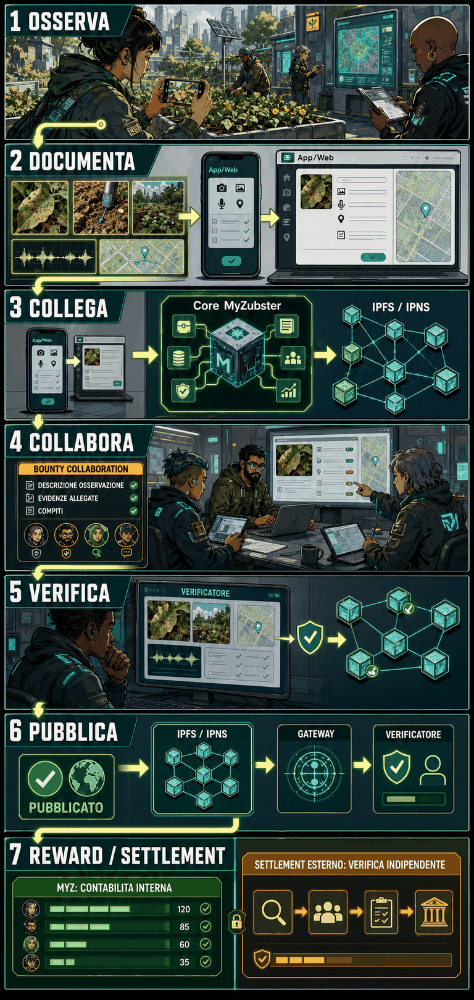

# Come funziona MyZubster

> Contributor visual guide for [bounty #526](https://github.com/MyZubster-Ecosystem/myzubster/issues/526).

## Deliverables

- `myzubster-how-it-works-cover.png` - portrait cover.
- `myzubster-how-it-works.png` - optimized README/web poster.
- `myzubster-how-it-works-hires.png` - high-resolution lossless poster.

## Narrative

The seven panels preserve the required workflow:

1. **Osserva** - a contributor observes an authorized real-world subject through App/Web.
2. **Documenta** - permitted media and context become structured evidence in Core MyZubster.
3. **Collega** - the observation is connected to a map, dataset, project or bounty.
4. **Collabora** - contributors work toward explicit acceptance criteria.
5. **Verifica** - a reviewer checks evidence; a file or pull request is not proof by itself.
6. **Pubblica** - sanitized public data can be published through IPFS/IPNS.
7. **Reward / settlement** - MYZ records internal accounting; any external settlement remains separate and independently verifiable.

The visual maps App/Web, Core MyZubster, observations/media, bounty collaboration,
IPFS/IPNS, Gateway and independent verification without presenting experimental
components as completed payment infrastructure. Canonical technical meaning remains
in [`ECOSYSTEM.md`](../ECOSYSTEM.md) and [`BOUNTIES.md`](../../BOUNTIES.md).

## Workflow and provenance

- **Creator:** [@Aming9303](https://github.com/Aming9303)
- **Workflow:** AI-assisted raster generation with human-directed architecture, storyboard, typography, composition, rights review and safety review.
- **Tool:** OpenAI image generation.
- **Inputs:** the seven-stage acceptance flow in bounty #526 plus the repository's canonical ecosystem and bounty documentation. No private source material was used.
- **Assembly:** generated as original portrait compositions, reviewed against the architecture and accounting boundaries, then exported as optimized and lossless PNG assets.
- **Regeneration:** use a portrait cyberpunk field-guide layout with seven clearly numbered panels; retain the exact Italian stage labels and the architecture components listed above; require the final panel to state `MYZ: CONTABILITA INTERNA` and `SETTLEMENT ESTERNO: VERIFICA INDIPENDENTE`; prohibit wallet addresses, transaction claims, or representations of external payment.

## Rights and safety

The contributor confirms that these are original generated/assembled assets and
contributes them under the repository's MIT license. They contain no copied character,
private data, credential, wallet address, seed, transaction identifier or sensitive
location. The imagery is explanatory artwork, not evidence of a real observation,
accepted bounty, MYZ allocation or external payment.

## Review status

`CONTRIBUTOR SUBMISSION / PROPOSED`

Merge, publication or a MYZ ledger entry must not be interpreted as proof of external
settlement. Only an independently verifiable transaction or actual receipt can establish
external payment.
