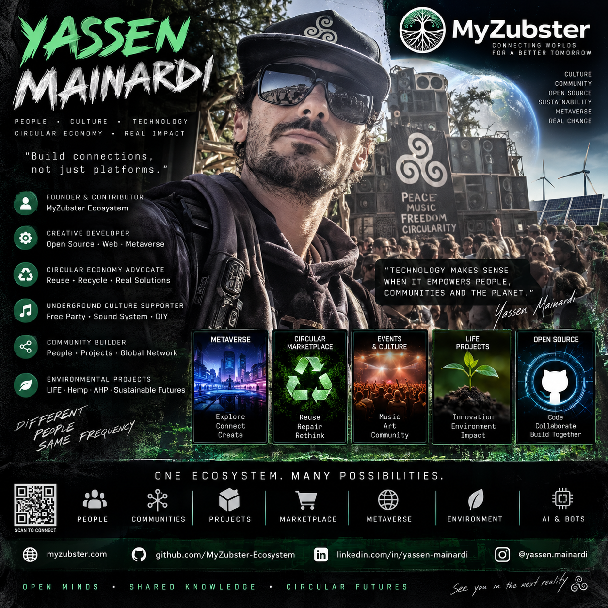

# Yassen Mainardi — MyZubster profile draft



**Status:** `DRAFT / PUBLIC-SAFE`  
**MyZubster role:** LIFE pilot candidate / future tester  
**GitHub linkage:** `PENDING_VERIFICATION`  
**LIFE plan linkage:** `PROPOSED / CONSENT PENDING`  
**LIFE objective:** `PROPOSED — EMPLOYMENT INCLUSION THROUGH MYZUBSTER`  
**Metaverse activation:** `PENDING_VERIFIED_LINKAGE`

## Public profile

Yassen Mainardi has a public GitHub repository dedicated to his MyZubster-related character/profile work:

- GitHub account: [`yassenmainardi`](https://github.com/yassenmainardi)
- Project repository: [`yassenmainardi/personaggio-yassen`](https://github.com/yassenmainardi/personaggio-yassen)
- Existing MyZubster relationship record: [`yassen-mainardi-friendship-declaration.md`](./yassen-mainardi-friendship-declaration.md)

The source repository describes Yassen as preparing a persistent digital profile and a possible future testing role connected to the MyZubster/LIFE direction.

## LIFE inclusion pilot direction

Yassen Mainardi's MyZubster profile may be used as the basis for a **proposed LIFE-oriented inclusion pilot**. This documentation records a candidate pathway only; it does not establish participant enrollment or consent. The operational concept is to test whether MyZubster can support participation, digital skills, autonomy, accessibility and access to suitable employment opportunities through a capability-first, participant-controlled pathway.

No LIFE pilot activity should be treated as active until explicit, purpose-specific participant consent is recorded through the appropriate process. This proposal does not establish employment, medical status, benefits eligibility or institutional enrollment. Any formal LIFE activity requiring personal or sensitive information must use a separate consent and data-protection process.

## Proposed employment pathway through MyZubster

If explicitly enabled by Yassen through the required consent process, the LIFE pilot could support the following participant-controlled flow:

```text
SKILLS + INTERESTS + GOALS
        ↓
MYZUBSTER WORK PROFILE
        ↓
ACCESSIBILITY / SUPPORT PREFERENCES
        ↓
TRAINING + PROJECT ACTIVITIES
        ↓
SUITABLE OPPORTUNITY DISCOVERY
        ↓
YASSEN REVIEWS AND CHOOSES
        ↓
APPLICATION ONLY WITH CONSENT
        ↓
FOLLOW-UP + OUTCOME TRACKING
        ↓
EMPLOYMENT / FURTHER SKILL DEVELOPMENT
```

### Employment-service requirements

MyZubster/Zorgax should, when these functions are implemented and explicitly enabled by Yassen:

- help describe skills, interests, experience and preferred activities;
- help build and maintain a work-oriented profile or CV from participant-approved information;
- surface potentially suitable jobs, collaborations, training and project opportunities;
- allow accessibility and practical support preferences to influence opportunity matching without publishing sensitive health data;
- explain opportunities in clear language and highlight relevant requirements;
- help prepare applications, messages and supporting material;
- require Yassen's approval before an application or personal information is sent to a third party;
- record applications and outcomes so the pilot can measure whether the service is useful;
- suggest skills or project activities that could improve future opportunities.

No automated component should make employment decisions on behalf of an employer or automatically disclose health/disability information. Matching should be treated as assistance and recommendation, with Yassen retaining control over applications and disclosures.

### Proposed pilot objectives

- create a persistent, participant-controlled digital project and work profile;
- support progressive use of GitHub, Zorgax and MyZubster tools;
- identify accessibility barriers and test practical mitigations;
- support documentation and explanation of completed work;
- encourage continuity, collaboration and increasing autonomy;
- connect verified project contributions to the MyZubster ecosystem;
- help identify suitable employment, collaboration and learning opportunities;
- measure progress from skills/profile creation toward applications and employment outcomes;
- prepare optional future metaverse participation after account/linkage verification.

### Proposed pilot indicators

- work profile/CV completeness using participant-approved information;
- activities or project tasks completed;
- potentially suitable opportunities identified;
- opportunities reviewed and selected by Yassen;
- participant-approved applications submitted;
- interviews, collaborations, training or work opportunities obtained;
- increasing autonomy in using GitHub, Zorgax and MyZubster tools;
- ability to document and explain completed work;
- continuity of participation over time;
- collaboration with other contributors;
- accessibility barriers encountered and mitigations tested;
- participant-defined learning or work goals;
- level of support required for specific activities.

The proposed pilot evaluates the accessibility and adaptability of the MyZubster ecosystem rather than scoring or defining Yassen by a medical condition. Public documentation should focus on capabilities, chosen goals, support needs, completed activities and progress that Yassen agrees to make public.

Any medical or disability-specific information is outside the public profile by default and must not be inferred from this file. If such information is ever needed for a formal pilot, it requires a separate, explicit and purpose-specific consent process and appropriate data protection handling.

## Zorgax preparation scope

Zorgax may prepare and maintain this **draft profile** using only:

- public information already published by Yassen;
- information Yassen explicitly provides for the profile;
- project metadata that can be independently checked;
- clearly marked pending fields where verification is not yet complete.

No private credentials are needed or stored.

## Profile state

```text
PUBLIC SOURCE MATERIAL
        ↓
ZORGAX-ASSISTED PROFILE DRAFT
        ↓
SOURCE / PROVENANCE CHECK
        ↓
PENDING FIELDS STAY UNVERIFIED
        ↓
GITHUB LINKAGE VERIFICATION
        ↓
MYZUBSTER PROFILE READY
        ↓
OPTIONAL LIFE PILOT AFTER EXPLICIT CONSENT
        ↓
OPTIONAL EMPLOYMENT-INCLUSION PATHWAY
        ↓
OPTIONAL METAVERSE ACTIVATION
```

## Current verified public facts

| Field | State |
|---|---|
| Public GitHub repository exists | `VERIFIED_PUBLIC` |
| Repository owner login | `yassenmainardi` |
| MyZubster relationship record exists | `VERIFIED_PUBLIC` |
| GitHub collaborator/write access for MyZubster | `NOT_VERIFIED` |
| MyZubster account ↔ GitHub account binding | `PENDING` |
| LIFE inclusion pilot linkage | `PROPOSED / CONSENT PENDING` |
| LIFE employment objective | `PROPOSED` |
| Formal LIFE participation/consent | `PENDING` |
| MyZubster automated job-matching/application functions | `IMPLEMENTATION / VERIFICATION REQUIRED` |
| Metaverse character activation | `PENDING` |

## Privacy and evidence boundary

This file intentionally avoids duplicating unnecessary personal details from source material. Public profile information should remain minimal, attributable and reviewable. A public GitHub repository, proposed LIFE pilot linkage or profile draft does not by itself prove legal identity, employment, partnership, institutional representation, health status, disability status, benefits eligibility, participant consent or authority to act for another person or organization.