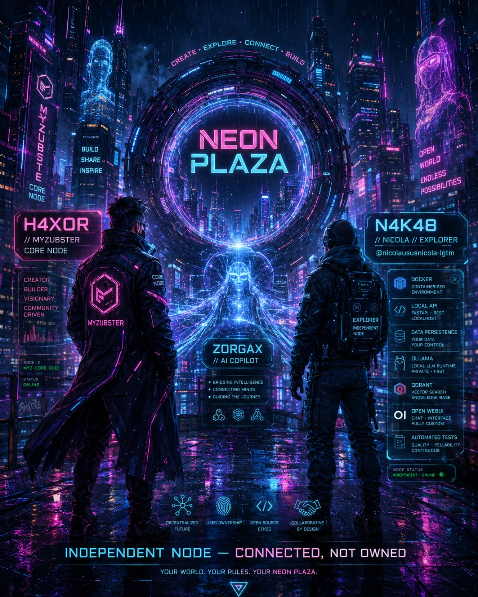

# MyZubster Metaverse — Neon Plaza v0.2

Neon Plaza is the first multiplayer social-space prototype for the MyZubster ecosystem.

It is designed around a simple idea: every participant can create a public narrative character, enter a shared world and interact with other characters while keeping identity claims separate from unverified profile data.

## Featured participant — N4K48 / Explorer



**N4K48** is Nicola's participant-authorized MyZubster narrative identity: an **Explorer** whose starting world is **Neon Plaza**.

This makes the linkage bidirectional:

```text
MyZubster Metaverse / Neon Plaza
            ↓
       N4K48 / Explorer
            ↓
Nicola's MyZubster MVP repository
            ↓
technical work, tests and evidence
            ↓
       MyZubster ecosystem
```

- [N4K48 character record in MyZubster](characters/N4K48.md)
- [Nicola's N4K48 visual + technical profile](https://github.com/nicolaususnicola-lgtm/myzubster-mvp)
- [MyZubster Visual universe](https://github.com/MyZubster-Ecosystem/MyZubster-Visual)
- [Neon Plaza — H4X0R and N4K48 visual](../visuals/drive-import-2026-09-03/Neon-Plaza-H4X0R-N4K48-Cyberpunk.jpg)
- [Local MyZubster visual set](../visuals/drive-import-2026-09-03/)
- [Zorgax cyberpunk visual](https://github.com/MyZubster-Ecosystem/MyZubster-Visual/blob/main/assets/zorgax/zorgax-cyberpunk-brand-ecosystem.jpg)
- [MyZubster decentralized-network visual](https://github.com/MyZubster-Ecosystem/MyZubster-Visual/blob/main/assets/cyberpunk-series/MyZubster-Cyberpunk-Serie-04-Rete-Decentralizzata.png)

The visual profile is **worldbuilding and navigation**, not proof of runtime activation or completed product functionality. Technical completion remains tied to code, tests, commits and other independently inspectable evidence.

## What v0.2 includes

- public avatar/character creator;
- five narrative archetypes: Guardian, Explorer, Maker, Chronicler and Scientist;
- shared 2D/2.5D world called **Neon Plaza**;
- keyboard and touch movement;
- shared presence through MongoDB-backed HTTP synchronization, with legacy Server-Sent Events compatibility;
- public plaza chat;
- proximity awareness (nearby characters);
- emotes;
- navigable portals connecting the world to Marketplace, LIFE projects, verified identity and Zorgax;
- session dashboard with online, nearby, chat and exploration progress;
- non-financial experience badges, explicitly separated from verified contribution claims;
- in-browser capability diagnostics and published minimum requirements;
- landmarks for MyZubster spaces:
  - Identity Hall;
  - Visual Gallery;
  - Zorgax Observatory;
  - Creator Lab.

## Architecture

```text
Browser / React
      |
      | POST join/move/chat/emote
      | GET event stream (SSE)
      v
MyZubster backend /api/metaverse
      |
      +-- in-memory presence
      +-- room state
      +-- event broadcast
      +-- public-safe avatar metadata
```

No additional realtime dependency is required for v0.1. Express handles commands and Server-Sent Events fan out world updates.

## Identity boundary

v0.1 intentionally runs in `guest-unverified` identity mode.

A user may type a MYZ-ID for display, but the server **does not** convert that value into a verified identity claim. This prevents usernames or arbitrary strings from being treated as proof.

Future integration with the MyZubster Digital Civic Registry (MYZ-DCR) should add cryptographic challenge/signature verification before an avatar can display a verified identity badge.

```text
Guest profile
    ↓
public character
    ↓
Neon Plaza session

Future:
MYZ-DCR identity + signature
    ↓
verified session credential
    ↓
verified public character
```

## Privacy and safety

The metaverse endpoint must not receive or store private keys, seed phrases, identity documents, passwords or recovery secrets.

The v0.1 server stores only temporary in-memory presence data. Chat is broadcast live and is not persisted by this prototype.

Before a broad public release, add:

- authenticated account/session handling;
- mute, block and report controls;
- moderation and abuse tooling;
- persistent database-backed world state where needed;
- distributed presence storage for multiple backend instances;
- anti-spam/rate-limit infrastructure beyond the prototype guards;
- privacy review and retention policy;
- age-appropriate community rules.

## Local development

Backend:

```bash
cd backend
npm start
```

Frontend:

```bash
cd frontend
REACT_APP_API_URL=http://localhost:3009 npm start
```

Then open MyZubster and choose **🪐 Metaverse**.

## Why 2D first?

The first goal is to validate the social protocol — identity, presence, movement, proximity and interaction — before introducing a heavy 3D rendering layer.

A later version can reuse the same concepts in Three.js/WebGL/VR without changing the core identity model.


## Direct routes

- `/metaverse` — Neon Plaza;
- `/marketplace` — Marketplace;
- `/life-pilot` — LIFE pilot projects;
- `/social-login` — account-linked identity;
- `/zorgax` — Zorgax experience.

## System requirements

The current 2D/2.5D experience is designed to remain lightweight.

Minimum recommended baseline:

- a current Chrome, Firefox, Edge or Safari release;
- JavaScript, Fetch API, local storage and CSS Grid;
- 2 GB RAM;
- viewport width of at least 320 px;
- stable 2 Mbps connection.

Recommended:

- 4 GB RAM;
- stable 5 Mbps connection;
- current desktop or mobile browser.

A dedicated GPU, VR headset, wallet and browser extension are not required. The
client runs a capability check and reports unavailable browser features. These
values are an initial compatibility baseline and must be refined with device and
network testing before a broad public release.

## Status boundary

Operational today: shared presence, movement, public chat, emotes, proximity,
persistent/account-linked characters, portals, session statistics and browser
diagnostics.

Still planned: private rooms, moderation controls, durable contribution badges,
3D rendering, WebXR, spatial audio, live IoT digital twins and portable identity.
