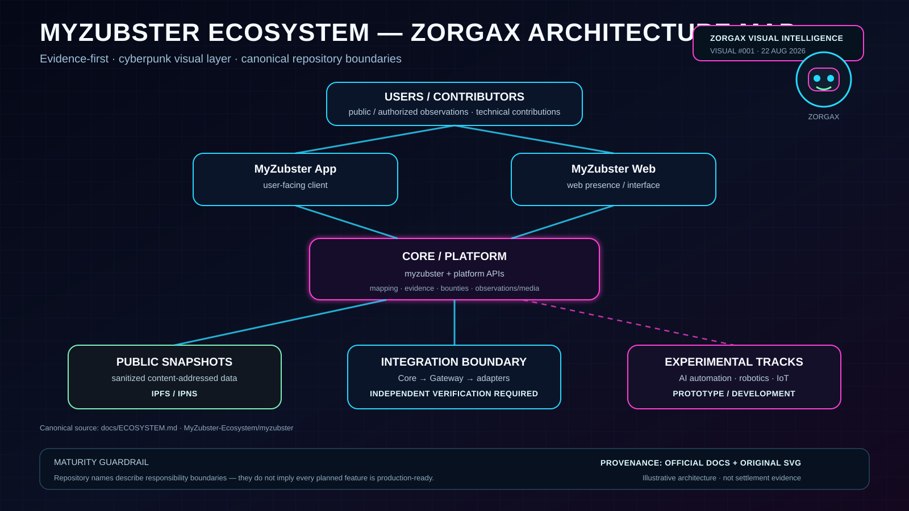

# Zorgax Visual #001 — Ecosystem Architecture

**Status:** draft visual documentation  
**Canonical source:** [`docs/ECOSYSTEM.md`](../../ECOSYSTEM.md)  
**Evidence role:** architecture reference only; not settlement, deployment, adoption or production evidence.

This package maps the documented responsibility boundaries between users/contributors, MyZubster App/Web, the core platform, public snapshots, integration boundaries and experimental AI/robotics/IoT tracks.

## Guardrails

- repository responsibility does not imply production readiness;
- experimental tracks remain explicitly prototype/development unless independently verified otherwise;
- external settlement/integration claims require independent evidence;
- the visual is derived documentation, not operational evidence.

## PC Upload Pack archive

The reviewed PNG render staged in `PC-UPLOAD-PACK-2026-08-22/READY-FOR-GITHUB` is archived on Google Drive as:

- `001-myzubster-ecosystem-architecture-zorgax.png`
- Drive file ID: `17to0RFWaOnP6sLSSUjSdUShEvlVKFoGO`

GitHub remains the versioned source of truth; the Drive asset is a working/archive render.
